<div align="center">

# 🔐 Lab 001 — Basic Router Security Configuration


*Part of my [CCNA 200-301 Study & Lab Tracker](../) series*

</div>

---

## 🎯 Objective

This lab demonstrates why the classic `enable password` command is **not secure by default**, and how the `service password-encryption` command changes that — using two Cisco 1941 routers (**R1** and **R2**) connected directly via their `GigabitEthernet0/0` interfaces.

<br>

## 🖧 Topology

| Device | Model | Interface | Role |
|---|---|---|---|
| R1 | Cisco 1941 | Gig0/0 | Router 1 |
| R2 | Cisco 1941 | Gig0/0 | Router 2 |

<p align="center">
  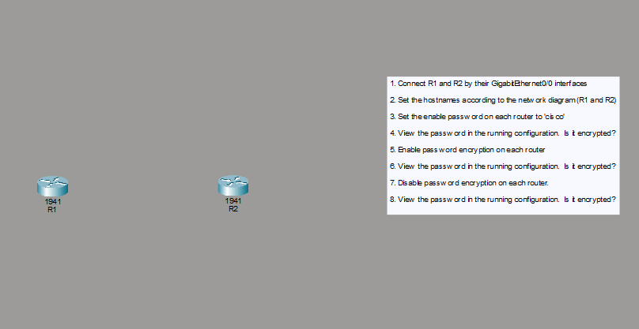
</p>
<p align="center">
  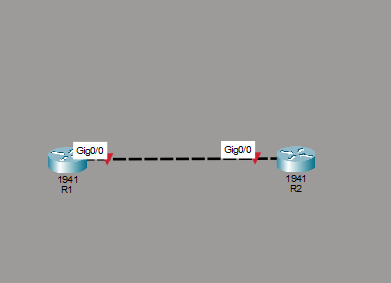
</p>

<br>

## 📋 Lab Tasks

1. Connect R1 and R2 by their GigabitEthernet0/0 interfaces
2. Set the hostnames according to the network diagram (R1 and R2)
3. Set the enable password on each router to `cisco`
4. View the password in the running configuration — is it encrypted?
5. Enable password encryption on each router
6. View the password in the running configuration — is it encrypted?
7. Disable password encryption on each router
8. View the password in the running configuration — is it encrypted?

<br>

## ⚙️ Step-by-Step Configuration

### 1️⃣ Set Hostnames

```bash
Router#configure terminal
Router(config)#hostname R1
```
*(Repeated on R2 with hostname `R2`)*

<p align="center">
  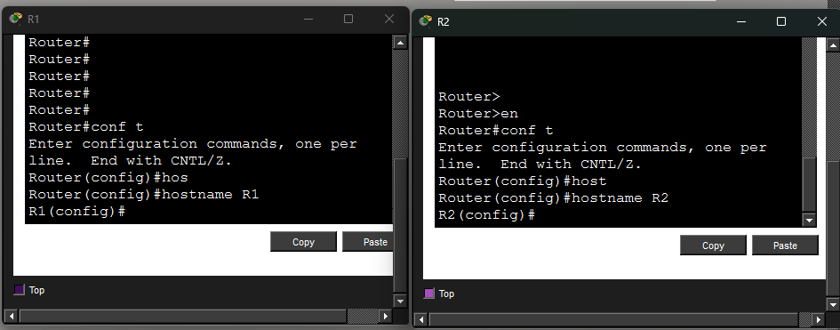
</p>

### 2️⃣ Set Enable Password

```bash
R1(config)#enable password cisco
R1(config)#exit
```

<p align="center">
  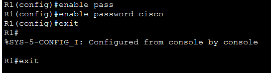
  <br/>
  
</p>

### 3️⃣ Verify — Before Encryption

```bash
R1#show running-config
...
enable password cisco
...
```

<p align="center">
  
  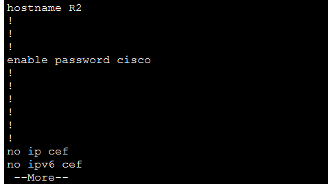
</p>

> 🔎 **Observation:** The password appears in **plain text**.
> **Is it encrypted? → ❌ NO**

### 4️⃣ Enable Password Encryption

```bash
R1(config)#service password-encryption
```
*(Repeated on R2)*

<p align="center">
  
  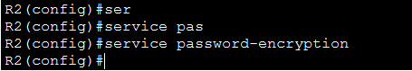
</p>

### 5️⃣ Verify — After Encryption

```bash
R1#show running-config
...
enable password 7 0822455D0A16
...
```

<p align="center">
  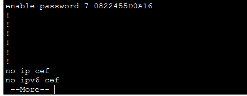
  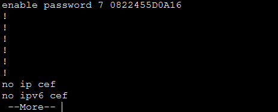
</p>

> 🔎 **Observation:** The password is now shown as a **Type 7 encoded value**.
> **Is it encrypted? → ✅ YES**

### 6️⃣ Disable Password Encryption

```bash
R1(config)#no service password-encryption
```
*(Repeated on R2)*

<p align="center">
  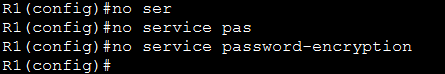
  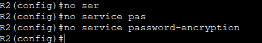
</p>

### 7️⃣ Verify — After Disabling Encryption

```bash
R1#show running-config
...
enable password 7 0822455D0A16
...
```

<p align="center">
  
  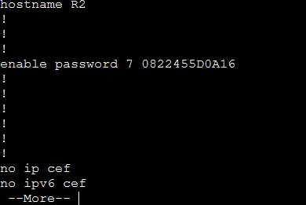
</p>

> 🔎 **Observation:** The password **stays encrypted** in the config even after the command is disabled.
> **Is it encrypted? → ✅ YES**

<br>

## 🧠 Key Takeaway

`service password-encryption` is a **one-way, retroactive-on-existing-passwords** setting:

- Turning it **ON** immediately obscures all plaintext passwords in the config using weak **Type 7** encoding.
- Turning it **OFF** only stops **future** passwords from being encrypted — it does **not** decrypt passwords that were already converted.
- ⚠️ Type 7 encryption is a simple XOR-based cipher and is **easily reversible** with widely available tools — it should never be relied on as real security. Use `enable secret` (MD5/SCRYPT-hashed) for genuine protection instead of `enable password`.

<br>

## 📊 Summary Table

| Step | Command | Password in Config | Encrypted? |
|---|---|---|---|
| 3 | `enable password cisco` | `enable password cisco` | ❌ No |
| 5 | `service password-encryption` | `enable password 7 0822455D0A16` | ✅ Yes |
| 7 | `no service password-encryption` | `enable password 7 0822455D0A16` | ✅ Yes *(unchanged)* |

<br>

## 🗂️ Files in This Lab

```text
📦 001-Basic-Router-Security-Configuration-1/
 ┣ 📄 001-Basic-Router-Security-Configuration-1.pkt   # Packet Tracer topology
 ┣ 📂 screenshots/                                     # Step-by-step CLI screenshots
 ┃ ┣ 🖼️ 01-topology-tasklist.png
 ┃ ┣ 🖼️ 02-topology-connected.png
 ┃ ┣ 🖼️ 03-hostname-config.png
 ┃ ┣ 🖼️ 04-enable-password-r1.png
 ┃ ┣ 🖼️ 05-enable-login-r1.png
 ┃ ┣ 🖼️ 06-running-config-r1-plaintext.png
 ┃ ┣ 🖼️ 07-running-config-r2-plaintext.png
 ┃ ┣ 🖼️ 08-service-encryption-r1.png
 ┃ ┣ 🖼️ 09-service-encryption-r2.png
 ┃ ┣ 🖼️ 10-running-config-r1-encrypted.png
 ┃ ┣ 🖼️ 11-running-config-r2-encrypted.png
 ┃ ┣ 🖼️ 12-no-service-encryption-r1.png
 ┃ ┣ 🖼️ 13-no-service-encryption-r2.png
 ┃ ┣ 🖼️ 14-running-config-r1-still-encrypted.png
 ┃ ┗ 🖼️ 15-running-config-r2-still-encrypted.png
 ┗ 📜 README.md                                        # This file
```

<br>

## 🔗 Related

- 🎥 Based on: [Jeremy's IT Lab — CCNA 200-301](https://youtube.com/playlist?list=PLxbwE86jKRgMQ4HTuaJ7yQgA2BoNwY9ct)
- 📁 Part of: [CCNA 200-301 Study & Packet Tracer Lab Tracker](../)

---

<div align="center">

🖇️ *Documented as part of hands-on CCNA 200-301 practice*

</div>
