<div align="center">

# 🔐 Lab 002 — Basic Router Security Configuration 2


*Part of my [CCNA 200-301 Study & Lab Tracker](../) series*

</div>

---

## 🎯 Objective

This lab builds on Lab 001 by introducing the **`enable secret`** command and comparing it against the older **`enable password`** command. It demonstrates password precedence, hash-based encryption (MD5, Type 5) vs. the weak Type 7 cipher, and confirms configuration persistence across a router **reload**, using two Cisco 1941 routers (**R1** and **R2**) connected via `GigabitEthernet0/0`.

<br>

## 🖧 Topology

| Device | Model | Interface | Role |
|---|---|---|---|
| R1 | Cisco 1941 | Gig0/0 | Router 1 |
| R2 | Cisco 1941 | Gig0/0 | Router 2 |

<p align="center">
  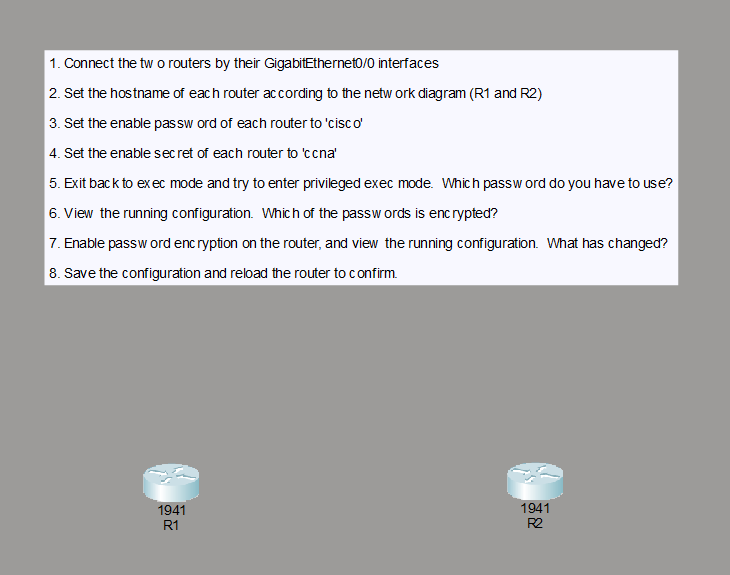
</p>
<p align="center">
  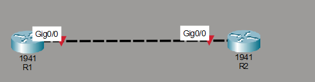
</p>

<br>

## 📋 Lab Tasks

1. Connect the two routers by their GigabitEthernet0/0 interfaces
2. Set the hostname of each router according to the network diagram (R1 and R2)
3. Set the enable password of each router to `cisco`
4. Set the enable secret of each router to `ccna`
5. Exit back to exec mode and try to enter privileged exec mode — which password do you have to use?
6. View the running configuration — which of the passwords is encrypted?
7. Enable password encryption on the router, and view the running configuration — what has changed?
8. Save the configuration and reload the router to confirm

<br>

## ⚙️ Step-by-Step Configuration

### 1️⃣ Set Hostnames

```bash
Router#conf t
Router(config)#hostname R1
```

<p align="center">
  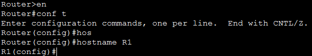
</p>

```bash
Router#conf t
Router(config)#hostname R2
```

<p align="center">
  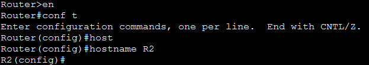
</p>

### 2️⃣ Set Enable Password (`cisco`)

```bash
R1(config)#enable password cisco
```

<p align="center">
  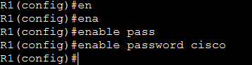
  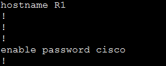
</p>

```bash
R2(config)#enable password cisco
```

<p align="center">
  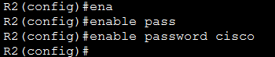
  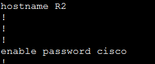
</p>

### 3️⃣ Set Enable Secret (`ccna`)

```bash
R1(config)#enable secret ccna
```

<p align="center">
  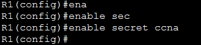
  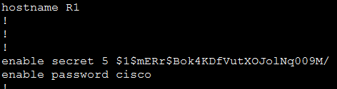
</p>

*(Verified with `do show run` while still inside configuration terminal.)*

```bash
R2(config)#enable secret ccna
```

<p align="center">
  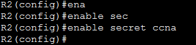
  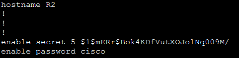
</p>

### 4️⃣ Which Password Actually Works?

```bash
R1>en
Password: [tried "cisco" → rejected]
Password: [tried again → rejected]
Password: % Bad secrets
R1>en
Password: [tried "ccna" → accepted]
R1#
```

<p align="center">
  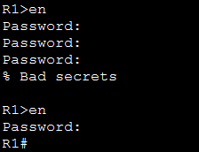
</p>

> 🔎 **Observation:** `enable password cisco` **no longer works** once `enable secret` is configured.
> **Which password do you have to use? → `ccna` (the enable secret)**

### 5️⃣ View Running Configuration — Which Password Is Encrypted?

```bash
R1#show running-config
...
enable secret 5 $1$mERr$Bok4KDfVutXOJolNq009M/
enable password cisco
...
```

<p align="center">
  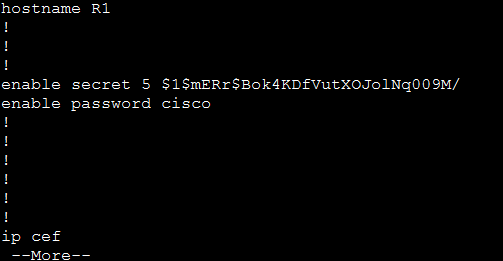
</p>

> 🔎 **Observation:** The `enable secret` is already **hashed (Type 5, MD5-based)** by default. The `enable password` is still shown in **plain text**.
> **Which of the passwords is encrypted? → Only the `enable secret`**

### 6️⃣ Enable Password Encryption

```bash
R1(config)#service password-encryption
```

<p align="center">
  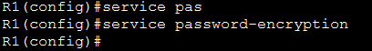
</p>

```bash
R1#show running-config
...
enable secret 5 $1$mERr$Bok4KDfVutXOJolNq009M/
enable password 7 0822455D0A16
...
```

<p align="center">
  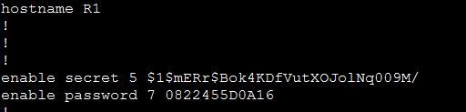
</p>

> 🔎 **Observation:** The `enable secret` hash is unchanged (it was already hashed). The `enable password` is now obscured with reversible **Type 7** encoding.
> **What has changed? → The plaintext `enable password` became a Type 7-encoded value; the `enable secret` hash stayed the same.**

### 7️⃣ Save & Reload to Confirm

```bash
R2#reload
System configuration has been modified. Save? [yes/no]: yes
Building configuration...
[OK]
Proceed with reload? [confirm]
```

<p align="center">
  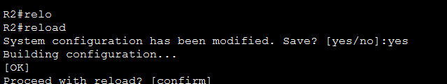
</p>

```bash
R2>en
Password: [ccna]
R2#
```

<p align="center">
  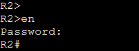
</p>

*(On R1, the config was saved explicitly with `write` before reloading.)*

```bash
R1#write
Building configuration...
[OK]
R1#reload
Proceed with reload? [confirm]
```

<p align="center">
  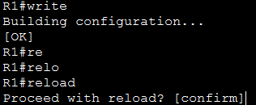
</p>

```bash
R1>en
Password: [ccna]
R1#
```

<p align="center">
  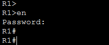
</p>

> 🔎 **Observation:** After reload, both routers still ask for the **enable secret** (`ccna`) to reach privileged EXEC mode, confirming the saved configuration survived the reload.

<br>

## 🧠 Key Takeaway

- When both `enable password` and `enable secret` are configured, **`enable secret` always takes priority** — the `enable password` is effectively ignored for authentication (though it remains stored in the config).
- `enable secret` is **hashed by default** (Type 5 / MD5-based) the moment you set it — no extra command needed.
- `enable password` is stored in **plain text** until `service password-encryption` is applied, and even then it only gets **weak, reversible Type 7 encoding** — never real hashing.
- `write` (or `copy running-config startup-config`) followed by `reload` is the standard way to confirm a configuration survives a reboot.
- 🛡️ **Best practice:** always use `enable secret` instead of `enable password` for privileged EXEC access.

<br>

## 📊 Summary Table

| Step | Command | Result in Config | Encrypted? |
|---|---|---|---|
| 3 | `enable password cisco` | `enable password cisco` | ❌ No (plain text) |
| 4 | `enable secret ccna` | `enable secret 5 $1$mERr$...` | ✅ Yes (Type 5 hash, automatic) |
| 5 | Login test | `enable secret` (`ccna`) wins over `enable password` | — |
| 7 | `service password-encryption` | `enable password 7 0822455D0A16` | ✅ Yes (Type 7, weak/reversible) |
| 8 | `write` + `reload` | Both passwords persist after reboot | — |

<br>

## 🗂️ Files in This Lab

```text
📦 002-Basic-Router-Security-Configuration-2/
 ┣ 📄 002-Basic-Router-Security-Configuration-2.pkt   # Packet Tracer topology
 ┣ 📂 screenshots/                                     # Step-by-step CLI screenshots
 ┃ ┣ 🖼️ 01-topology-tasklist.png
 ┃ ┣ 🖼️ 02-topology-connected.png
 ┃ ┣ 🖼️ 03-hostname-r1.png
 ┃ ┣ 🖼️ 04-hostname-r2.png
 ┃ ┣ 🖼️ 05-enable-password-r1-cmd.png
 ┃ ┣ 🖼️ 06-enable-password-r1-config.png
 ┃ ┣ 🖼️ 07-enable-password-r2-cmd.png
 ┃ ┣ 🖼️ 08-enable-password-r2-config.png
 ┃ ┣ 🖼️ 09-enable-secret-r1-cmd.png
 ┃ ┣ 🖼️ 10-enable-secret-r1-config.png
 ┃ ┣ 🖼️ 11-enable-secret-r2-cmd.png
 ┃ ┣ 🖼️ 12-enable-secret-r2-config.png
 ┃ ┣ 🖼️ 13-r1-login-bad-secret-then-success.png
 ┃ ┣ 🖼️ 14-running-config-r1-before-encryption.png
 ┃ ┣ 🖼️ 15-service-encryption-r1-cmd.png
 ┃ ┣ 🖼️ 16-running-config-r1-after-encryption.png
 ┃ ┣ 🖼️ 17-r2-write-reload.png
 ┃ ┣ 🖼️ 18-r2-post-reload-login.png
 ┃ ┣ 🖼️ 19-r1-write-reload.png
 ┃ ┗ 🖼️ 20-r1-post-reload-login.png
 ┗ 📜 README.md                                        # This file
```

<br>

## 🔗 Related

- 🎥 Based on: [Jeremy's IT Lab — CCNA 200-301](https://youtube.com/playlist?list=PLxbwE86jKRgMQ4HTuaJ7yQgA2BoNwY9ct)
- 📁 Part of: [CCNA 200-301 Study & Packet Tracer Lab Tracker](../)
- ⬅️ Previous: [Lab 001 — Basic Router Security Configuration 1](../001-Basic-Router-Security-Configuration-1/)

---

<div align="center">

🖇️ *Documented as part of hands-on CCNA 200-301 practice*

</div>
