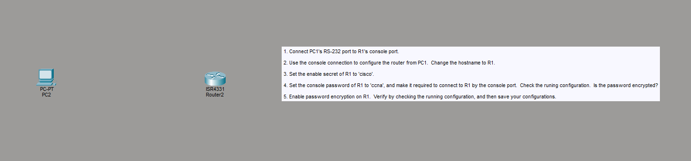
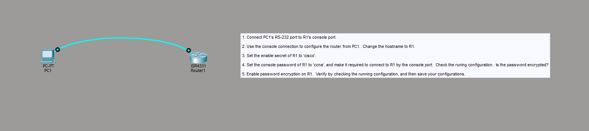
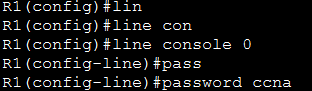
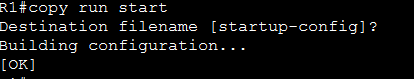

<div align="center">

# 🔐 003 - Basic Router Security Configuration 3


*Securing console (physical) access to a Cisco router with passwords and password encryption*

</div>

---

## 🎯 Objective

This lab builds on basic router hardening by focusing on **console-line security**. Instead of relying only on the `enable secret` to protect privileged EXEC mode, it locks down the very first point of entry — the **console port** — and then demonstrates why plaintext passwords in the running configuration are a security risk that `service password-encryption` helps mitigate.

By the end of this lab, the router requires a password just to reach user EXEC mode via the console cable, and every clear-text password type in the config is obfuscated with a type 7 encryption.

---

## 🗺️ Topology

| Device | Model | Role | Connection |
|--------|-------|------|------------|
| PC1 | PC-PT | Admin workstation | RS-232 → Router console port |
| Router1 | Cisco ISR4331 | Device under configuration (R1) | Console (rollover) cable |

```
PC1 (RS-232) <----console cable----> ISR4331 (Console Port) — R1
```

---

## 📋 Lab Tasks

1. Connect PC1's RS-232 port to R1's console port.
2. Use the console connection to configure the router from PC1. Change the hostname to `R1`.
3. Set the enable secret of R1 to `cisco`.
4. Set the console password of R1 to `ccna`, and make it required to connect to R1 by the console port. Check the running configuration — is the password encrypted?
5. Enable password encryption on R1. Verify by checking the running configuration, and then save your configurations.

---

## 🛠️ Step-by-Step Configuration

### Step 1 — Connect PC1 to R1 via the Console Port

The console cable (RS-232) is run from PC1 directly into R1's console port — this is the out-of-band management connection used for initial device configuration.

| Before Connecting | After Connecting |
|---|---|
|  |  |

---

### Step 2 — Set the Hostname

```
Router(config)#hostname R1
R1(config)#
```


---

### Step 3 — Set the Enable Secret

```
R1(config)#enable secret cisco
```


---

### Step 4 — Require a Console Password

```
R1(config)#line console 0
R1(config-line)#password ccna
R1(config-line)#login
```



Checked the running configuration to see how the password is stored:

```
line con 0
 password ccna
 login
!
```


> 🔎 **Observation:** The console password `ccna` appears **in plaintext** in the running configuration. Anyone who can view `show running-config` (or an unsecured backup of it) can read the password directly — this is the vulnerability the next step addresses.

---

### Step 5 — Enable Password Encryption, Verify, and Save

```
R1(config)#service password-encryption
R1(config)#exit
```


Checked the running configuration again to verify the fix:

```
line con 0
 password 7 08224F4008
 login
!
```


> 🔎 **Observation:** After enabling `service password-encryption`, the same `ccna` password now shows as a **type 7 encoded string** (`08224F4008`) instead of plaintext. Note that type 7 is a weak, easily reversible obfuscation (not strong encryption) — it stops casual shoulder-surfing of configs but should never be relied on as real security. `enable secret` (type 5/9 hashing) remains the stronger protection for privileged EXEC access.

Saved the configuration to NVRAM:

```
R1#copy run start
Destination filename [startup-config]?
Building configuration...
[OK]
```



---

## 💡 Key Takeaway

A device isn't secure just because privileged EXEC mode has a password — **every line of access matters**, including the physical console port. Just as important: setting a password isn't enough on its own if it's stored in plaintext. `service password-encryption` is a quick, low-cost step that should be applied to every router as a baseline hardening measure, alongside (not instead of) stronger hashing like `enable secret`.

---

## 📊 Summary Table — Before vs. After Password Encryption

| Line | Password Type | Stored As (Before) | Stored As (After `service password-encryption`) |
|------|---------------|---------------------|----------------------------------------------------|
| `line console 0` | Type 0 (plaintext) → Type 7 | `password ccna` | `password 7 08224F4008` |
| `enable secret` | Type 5/9 (hashed) | Already hashed by default | Unaffected — always hashed |

---

## 📁 Files in This Lab

```
003-Basic-Router-Security-Configuration-3/
├── README.md
└── screenshots/
    ├── 01-topology-before-connection.png
    ├── 02-topology-console-connected.png
    ├── 03-hostname-r1.png
    ├── 04-enable-secret-cisco.png
    ├── 05-line-console-password-ccna.png
    ├── 06-show-run-password-unencrypted.png
    ├── 07-service-password-encryption.png
    ├── 08-show-run-password-encrypted.png
    └── 09-copy-run-start-save.png
```
