<div align="center">

# 🔌 Lab 004 — Basic Serial Connection Configuration


*Configuring and verifying a point-to-point serial (WAN) connection between two Cisco routers*

</div>

---

## 🎯 Objective

This lab walks through bringing up a **DCE/DTE serial WAN link** between two routers from a blank config to a fully pingable connection. By the end of it, you'll be comfortable:

- Using **CDP** to map out physical connections without touching a cable
- Telling a **DCE** interface apart from a **DTE** interface on a serial link
- Setting **clock rate** on the DCE end (a step that trips up almost everyone the first time)
- Assigning IP addresses to serial interfaces and bringing them up with `no shutdown`
- Verifying end-to-end reachability with `ping`

---

## 🗺️ Topology

<p align="center">
  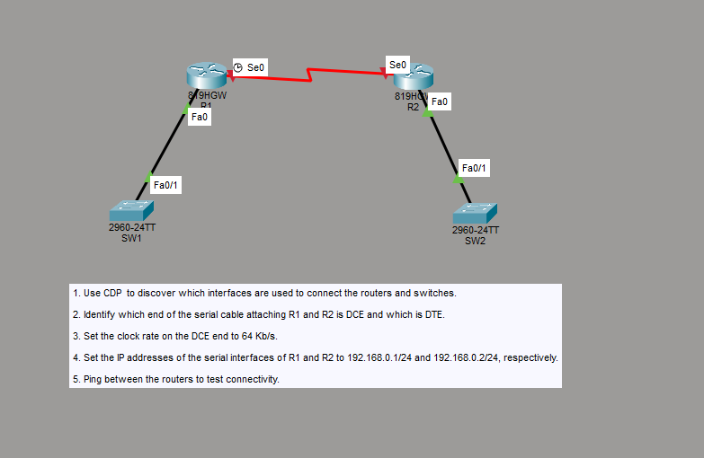
</p>

| Device | Type | Interface | Connects To | Role |
|--------|------|-----------|-------------|------|
| **R1** | 819HGW Router | Se0 | R2 (Se0) | Serial **DCE** end |
| **R1** | 819HGW Router | Fa0 | SW1 (Fa0/1) | LAN uplink |
| **R2** | 819HGW Router | Se0 | R1 (Se0) | Serial **DTE** end |
| **R2** | 819HGW Router | Fa0 | SW2 (Fa0/1) | LAN uplink |
| **SW1** | 2960-24TT Switch | Fa0/1 | R1 (Fa0) | Access switch |
| **SW2** | 2960-24TT Switch | Fa0/1 | R2 (Fa0) | Access switch |

---

## 📋 Lab Tasks

1. Use CDP to discover which interfaces are used to connect the routers and switches.
2. Identify which end of the serial cable attaching R1 and R2 is DCE and which is DTE.
3. Set the clock rate on the DCE end to 64 Kb/s.
4. Set the IP addresses of the serial interfaces of R1 and R2 to `192.168.0.1/24` and `192.168.0.2/24`, respectively.
5. Ping between the routers to test connectivity.

---

## 🛠️ Step-by-Step Configuration

### 1️⃣ Discover connections with CDP

**Command (R1 & R2):**
```
show cdp neighbors
```
*(or `show cdp neighbors detail` for full IP and platform info)*

**R1's neighbor table:**

<p align="center">
  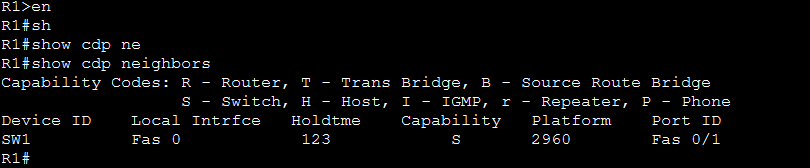
</p>

**R2's neighbor table:**

<p align="center">
  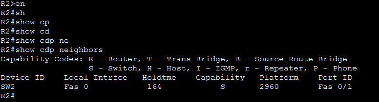
</p>

> 🔎 **Observation:** CDP confirms R1's `Fa0` lands on SW1's `Fa0/1`, and R2's `Fa0` lands on SW2's `Fa0/1` — exactly matching the topology diagram, with zero cables physically traced.

---

### 2️⃣ Identify the DCE and DTE ends of the serial link

**Command (R1 & R2):**
```
show controllers Serial 0
```
*(look for the line specifying `DCE V.35` or `DTE V.35`)*

**R1 — Serial 0:**

<p align="center">
  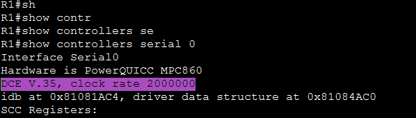
</p>

**R2 — Serial 0:**

<p align="center">
  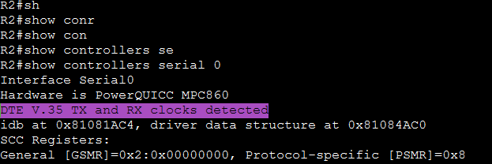
</p>

> 🔎 **Observation:** R1's Se0 reports `DCE V.35`, while R2's Se0 reports `DTE V.35 TX and RX clocks detected`. This matches the clock icon shown next to R1 in Packet Tracer — **R1 is the DCE end**, so R1 owns the clocking responsibility for the link.

---

### 3️⃣ Set the clock rate on the DCE end (R1)

```
R1> enable
R1# configure terminal
R1(config)# interface Serial 0
R1(config-if)# clock rate 64000
R1(config-if)# exit
```

<p align="center">
  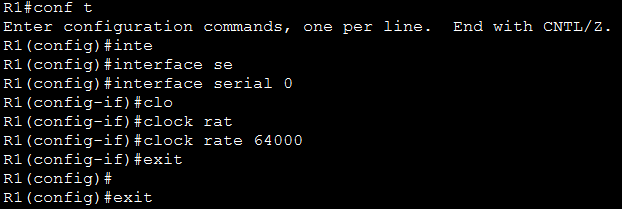
</p>

**Verify:**
```
R1# show controllers serial 0
```

<p align="center">
  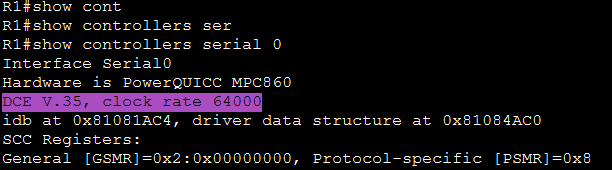
</p>

> 🔎 **Observation:** The output now reads `DCE V.35, clock rate 64000` — confirming the 64 Kb/s clock rate is active on the DCE side. Clock rate is only ever set on the DCE end; setting it on a DTE interface has no effect.

---

### 4️⃣ Assign IP addresses to the serial interfaces

**R1 configuration:**
```
R1> enable
R1# configure terminal
R1(config)# interface Serial 0
R1(config-if)# ip address 192.168.0.1 255.255.255.0
R1(config-if)# no shutdown
R1(config-if)# exit
```

<p align="center">
  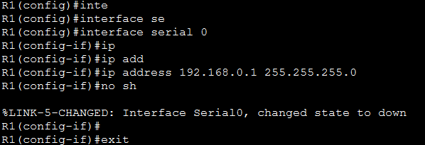
</p>

**R2 configuration:**
```
R2> enable
R2# configure terminal
R2(config)# interface Serial 0
R2(config-if)# ip address 192.168.0.2 255.255.255.0
R2(config-if)# no shutdown
R2(config-if)# exit
```

<p align="center">
  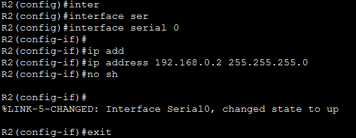
</p>

> 🔎 **Observation:** R1's link initially reports `changed state to down` because R2's end wasn't up yet. Once R2 gets `no shutdown` applied, R2 logs `changed state to up` — the line protocol only comes up once **both** ends are configured and un-shut.

---

### 5️⃣ Test connectivity with ping

**From R1:**
```
R1# ping 192.168.0.2
```

<p align="center">
  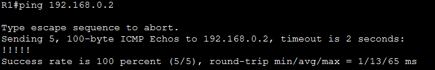
</p>

**From R2:**
```
R2# ping 192.168.0.1
```

<p align="center">
  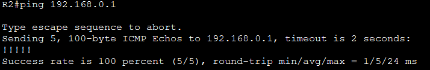
</p>

> 🔎 **Observation:** Both directions return `Success rate is 100 percent (5/5)`. The serial link is fully operational, confirming CDP discovery, DCE/DTE identification, clocking, and IP addressing were all done correctly.

---

## 💡 Key Takeaway

A serial WAN link won't pass traffic just because two routers are physically connected — **the DCE end must provide clocking** (`clock rate`) before the DTE end can synchronize, and **both** ends need valid IP addressing plus `no shutdown` before the line protocol comes up. `show cdp neighbors` and `show controllers serial 0` are the two commands that take the guesswork out of identifying *what's* connected and *which side* is responsible for the clock.

---

## 📊 Summary Table

| Check | Before Config | After Config |
|-------|:---:|:---:|
| Serial 0 clock rate (R1/DCE) | Not set | `64000` |
| R1 Se0 IP address | Unassigned | `192.168.0.1/24` |
| R2 Se0 IP address | Unassigned | `192.168.0.2/24` |
| Serial0 line protocol | `down` | `up` |
| R1 → R2 ping | N/A | `5/5` success (100%) |
| R2 → R1 ping | N/A | `5/5` success (100%) |

---

## 📁 Files in This Lab

```
004-basic-serial-connection-configuration/
├── README.md
└── screenshots/
    ├── 01-topology-diagram.png
    ├── 02-r1-cdp-neighbors.png
    ├── 03-r2-cdp-neighbors.png
    ├── 04-r1-controllers-dce.png
    ├── 05-r2-controllers-dte.png
    ├── 06-r1-clock-rate-config.png
    ├── 07-r1-controllers-clockrate-verify.png
    ├── 08-r1-ip-address-config.png
    ├── 09-r2-ip-address-config.png
    ├── 10-r1-ping-r2.png
    └── 11-r2-ping-r1.png
```

---

<div align="center">

*Part of a structured CCNA 200-301 Packet Tracer lab series.*

</div>
