<div align="center">

# 🔀 Lab 005 — VLAN Configuration


</div>

---

## 🎯 Objective

This lab teaches how **VLANs (Virtual LANs)** segment a switched network into separate broadcast domains, and why an **access port** alone can't carry that segmentation across multiple switches. Working across two switches (`SW1` and `SW2`), the lab walks through creating VLANs, assigning access ports, watching inter-VLAN connectivity break between switches, and fixing it by configuring the switch-to-switch link as an **802.1Q trunk**.

By the end, the lab demonstrates:
- How to create and assign VLANs on a Cisco switch
- The difference between an **access port** and a **trunk port**
- Why VLAN traffic cannot cross an access-mode uplink
- That devices in the *same* VLAN can reach each other across switches once trunking is enabled — but devices in *different* VLANs still can't, without a router

---

## 🖧 Topology

| Device | Role | Interface | VLAN | IP Address |
|--------|------|-----------|------|------------|
| PC1 | End device | Fa0 → SW1 Fa0/2 | VLAN 10 | 10.0.0.1/24 |
| PC2 | End device | Fa0 → SW1 Fa0/3 | VLAN 20 | 10.0.0.2/24 |
| PC3 | End device | Fa0 → SW2 Fa0/2 | VLAN 10 | 10.0.0.3/24 |
| PC4 | End device | Fa0 → SW2 Fa0/3 | VLAN 20 | 10.0.0.4/24 |
| SW1 | 2960-24TT switch | Fa0/1 → SW2 Fa0/1 | Trunk (802.1Q) | — |
| SW2 | 2960-24TT switch | Fa0/1 → SW1 Fa0/1 | Trunk (802.1Q) | — |

> PC1 and PC3 belong to **VLAN 10**; PC2 and PC4 belong to **VLAN 20**. SW1 and SW2 are connected via `Fa0/1` on each switch.

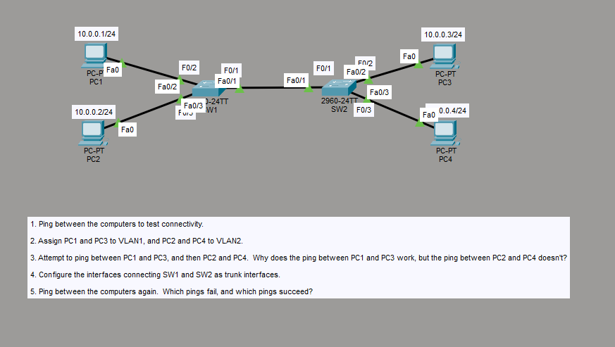

---

## 📋 Lab Tasks

1. Ping between the computers to test connectivity.
2. Assign PC1 and PC3 to VLAN1, and PC2 and PC4 to VLAN2.
3. Attempt to ping between PC1 and PC3, and then PC2 and PC4. Why does the ping between PC1 and PC3 work, but the ping between PC2 and PC4 doesn't?
4. Configure the interfaces connecting SW1 and SW2 as trunk interfaces.
5. Ping between the computers again. Which pings fail, and which pings succeed?

---

## ⚙️ Step-by-Step Configuration

### 1️⃣ Baseline connectivity test

Before any VLAN configuration, all four PCs sit in the default VLAN 1 and can reach each other freely.

```
C:\>ping 10.0.0.3
C:\>ping 10.0.0.4
C:\>ping 10.0.0.1
```

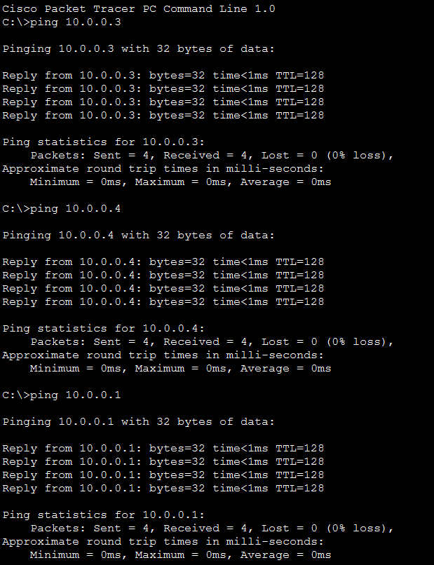

> 🔎 **Observation:** All pings succeed with 0% loss — every device is still in the default VLAN, so there's nothing to segment traffic yet.

---

### 2️⃣ Assign VLANs on SW1

PC1 (`Fa0/2`) is placed in **VLAN 10**, and PC2 (`Fa0/3`) is placed in **VLAN 20**. Since neither VLAN exists yet, IOS auto-creates them on the fly.

```
SW1(config)#interface fastEthernet 0/3
SW1(config-if)#switchport mode access
SW1(config-if)#switchport access vlan 20
% Access VLAN does not exist.  Creating vlan 20

SW1(config-if)#no shutdown
SW1(config-if)#exit

SW1(config)#interface fastEthernet 0/2
SW1(config-if)#switchport mode access
SW1(config-if)#switchport access vlan 10
% Access VLAN does not exist.  Creating vlan 10
```

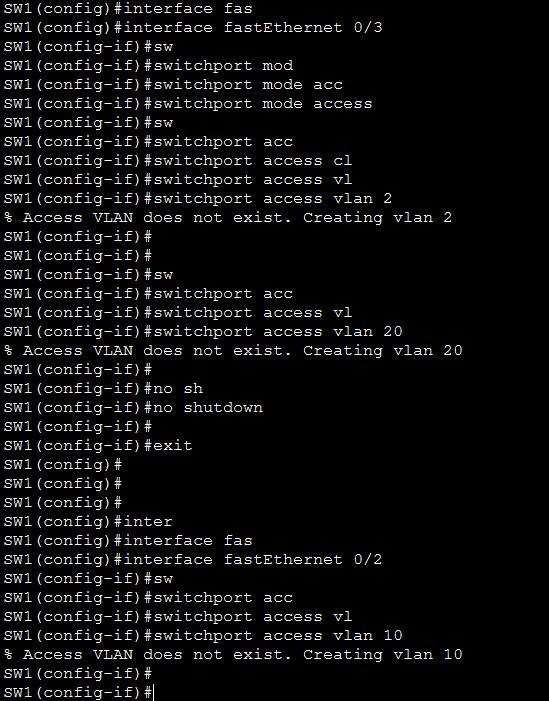

Verify with `show vlan brief`:

```
SW1#show vlan brief
```

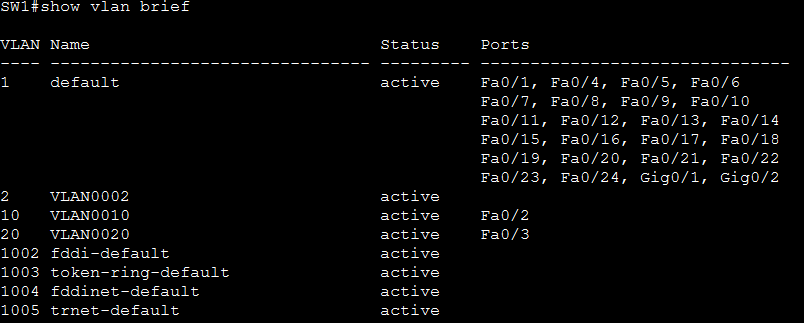

> 🔎 **Observation:** `Fa0/2` now sits in VLAN 10 and `Fa0/3` sits in VLAN 20 — confirmed in the VLAN table, with both new VLANs auto-named `VLAN0010` and `VLAN0020`.

---

### 3️⃣ Assign VLANs on SW2

The same pattern is repeated on SW2: PC3 (`Fa0/2`) joins **VLAN 10**, and PC4 (`Fa0/3`) joins **VLAN 20**.

```
SW2(config)#interface fastEthernet 0/2
SW2(config-if)#switchport mode access
SW2(config-if)#switchport access vlan 10
% Access VLAN does not exist.  Creating vlan 10
SW2(config-if)#no shutdown
SW2(config-if)#exit

SW2(config)#interface fastEthernet 0/3
SW2(config-if)#switchport mode access
SW2(config-if)#switchport access vlan 20
% Access VLAN does not exist.  Creating vlan 20
```

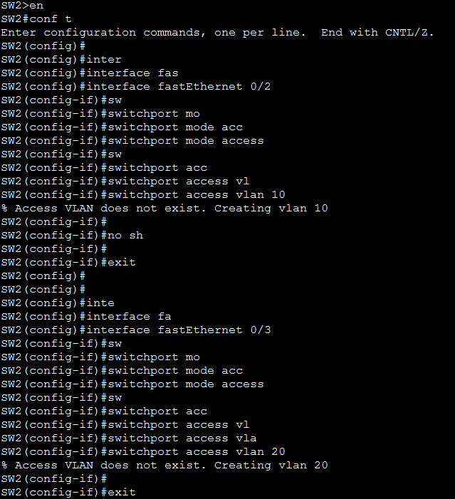

Verify with `show vlan brief`:

```
SW2#show vlan brief
```

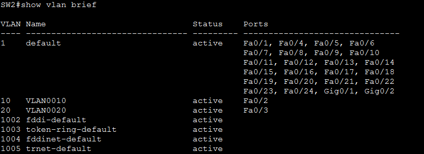

> 🔎 **Observation:** SW2 mirrors SW1's VLAN layout — `Fa0/2` in VLAN 10, `Fa0/3` in VLAN 20 — but the two switches still have no way to share VLAN traffic between them yet.

---

### 4️⃣ Test connectivity across switches (before trunking)

With VLANs assigned but the switch-to-switch link (`Fa0/1`) still in **access mode**, cross-switch pings are attempted from PC2.

```
C:\>ping 10.0.0.3
C:\>ping 10.0.0.4
```

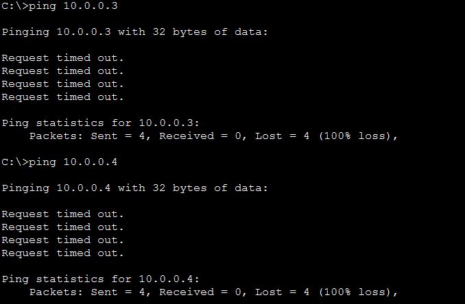
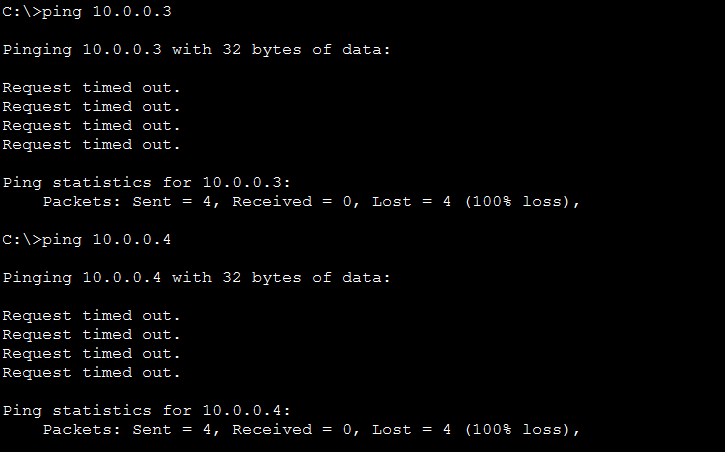

> 🔎 **Observation:** Both pings from PC2 time out completely (100% loss) — even the ping to PC4, which is in the *same* VLAN 20. That's because `Fa0/1` between SW1 and SW2 is an **access port**, which can only carry a single VLAN at a time (whatever VLAN it happens to be in — VLAN 1 or VLAN 10 by default), so VLAN 20 traffic never crosses the link. **Note:** if PC1↔PC3 was tested at this point it *could* succeed, but only if the access link happened to be sitting in VLAN 10 already — otherwise, all inter-switch traffic fails identically until a trunk is configured.

---

### 5️⃣ Configure the SW1 ↔ SW2 link as an 802.1Q trunk

The fix: turn the `Fa0/1` link on **both** switches into a trunk port, so it can carry tagged traffic for every VLAN.

**On SW1:**

```
SW1(config)#interface fastEthernet 0/1
SW1(config-if)#switchport mode trunk
SW1(config-if)#no shutdown
```

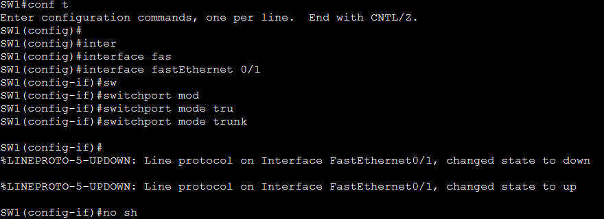

**On SW2:**

```
SW2(config)#interface fastEthernet 0/1
SW2(config-if)#switchport mode trunk
SW2(config-if)#no shutdown
```

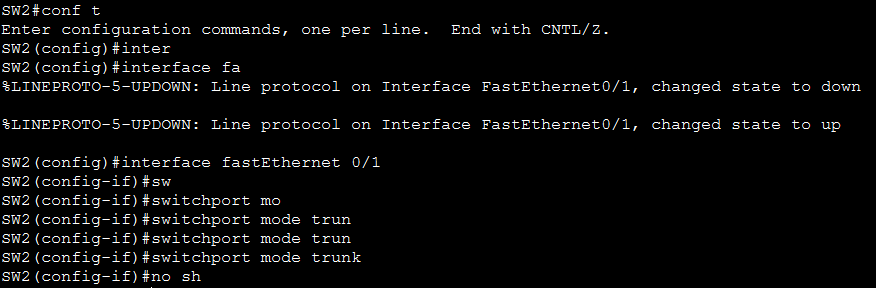

> 🔎 **Observation:** Both interfaces flap (down/up) as trunk negotiation completes, then come back up — the link is now an 802.1Q trunk capable of carrying VLAN 10 and VLAN 20 traffic simultaneously, tagged by VLAN ID.

---

### 6️⃣ Re-test connectivity after trunking

```
C:\>ping 10.0.0.3
C:\>ping 10.0.0.4
```

**From PC2 (VLAN 20):**

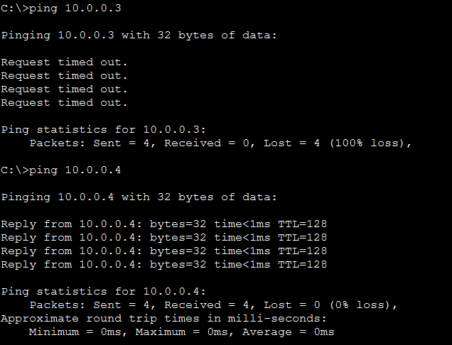

**From PC1 (VLAN 10):**

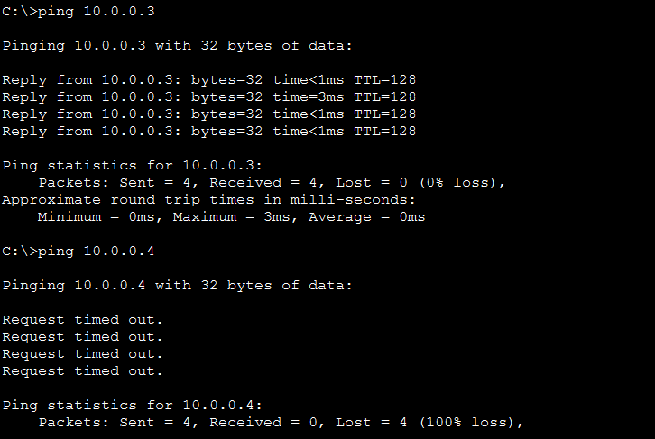

> 🔎 **Observation:** PC2 now successfully reaches PC4 (same VLAN 20, across the trunk) but still can't reach PC3 (different VLAN). Symmetrically, PC1 successfully reaches PC3 (same VLAN 10) but not PC4 (different VLAN). The trunk restored *intra-VLAN* connectivity across switches — it did **not** enable *inter-VLAN* routing, which would require a Layer 3 device.

---

## 💡 Key Takeaway

A **trunk port** — not an access port — is required to carry multiple VLANs across a switch-to-switch link. Access ports can only belong to (and forward) a single VLAN, so any inter-switch link carrying more than one VLAN must be configured with `switchport mode trunk`. However, trunking only restores connectivity **within** the same VLAN across switches; devices in *different* VLANs remain isolated at Layer 2 and need a router or Layer 3 switch to communicate (inter-VLAN routing).

---

## 📊 Summary Table

| Test Stage | PC1 → PC3 (VLAN 10 ↔ VLAN 10) | PC2 → PC4 (VLAN 20 ↔ VLAN 20) | PC1 ↔ PC2 / PC3 ↔ PC4 (VLAN 10 ↔ VLAN 20) |
|---|---|---|---|
| **Before VLANs** (Task 1) | ✅ Success | ✅ Success | ✅ Success |
| **After VLANs, access link** (Task 3) | ❌ Fail | ❌ Fail | ❌ Fail |
| **After trunk configured** (Task 5) | ✅ Success | ✅ Success | ❌ Fail (needs inter-VLAN routing) |

---

## 📂 Files in This Lab

```
005-VLAN-Configuration/
├── README.md
└── screenshots/
    ├── 01-topology-and-lab-tasks.png
    ├── 02-baseline-connectivity-test.png
    ├── 03-sw1-vlan-assignment.png
    ├── 04-sw1-show-vlan-brief.png
    ├── 05-sw2-vlan-assignment.png
    ├── 06-sw2-show-vlan-brief.png
    ├── 07-pc2-ping-pc3-pc4-fail-1.png
    ├── 08-pc2-ping-pc3-pc4-fail-2.png
    ├── 09-sw1-trunk-config.png
    ├── 10-sw2-trunk-config.png
    ├── 11-pc2-ping-after-trunk.png
    └── 12-pc1-ping-after-trunk.png
```
