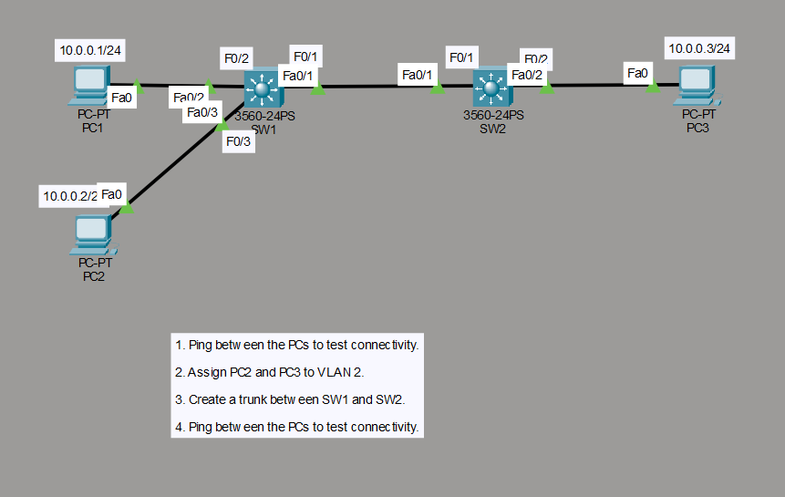
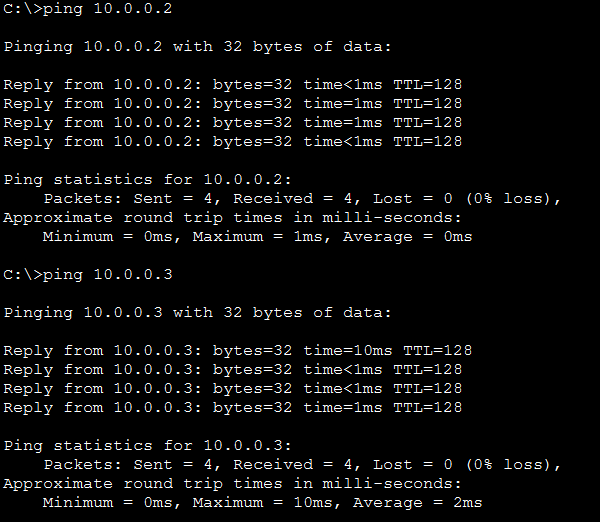
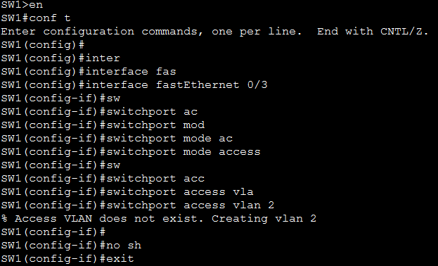
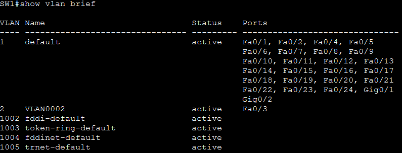
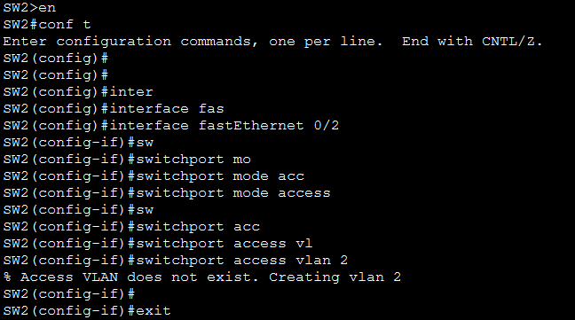
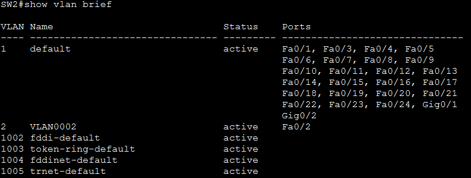
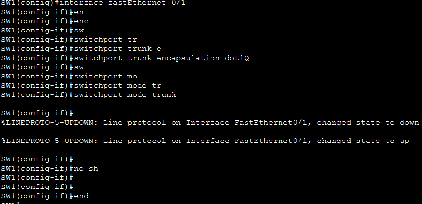
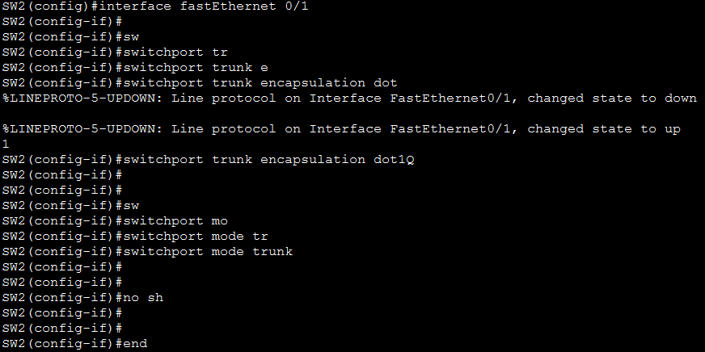
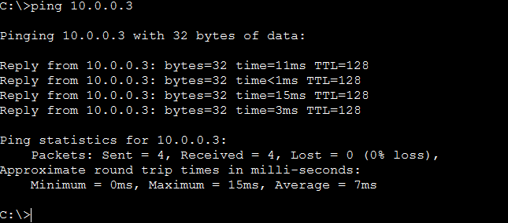
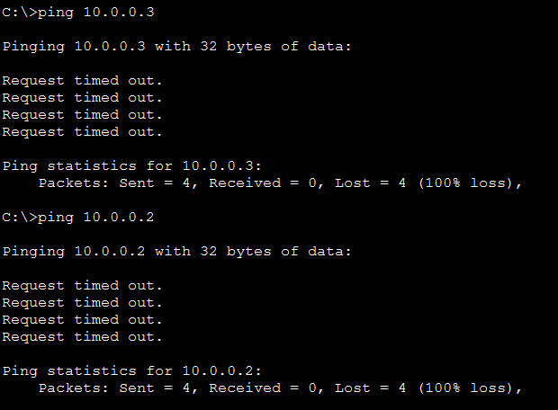

<div align="center">

# 🔀 Lab 006 — VLAN Configuration: Trunk Encapsulation


</div>

---

## 🎯 Objective

This lab builds directly on VLAN fundamentals by introducing **trunk encapsulation** on Cisco Catalyst 3560 switches — Layer 3 switches that, unlike the 2960 series, require the encapsulation type (`dot1q`) to be set explicitly before a port can be switched into trunk mode. Working across two 3560-24PS switches (`SW1` and `SW2`), the lab creates VLAN 2, moves two of the three PCs into it, trunks the inter-switch link, and observes exactly which pings succeed and which fail as a result.

By the end, the lab demonstrates:
- How to create a named VLAN and assign access ports to it
- Why the 3560 platform requires `switchport trunk encapsulation dot1q` before `switchport mode trunk`
- That trunking restores connectivity **only** between devices in the *same* VLAN across switches
- That a device left behind in the default VLAN (VLAN 1) is completely isolated from devices moved into VLAN 2, even after trunking

---

## 🖧 Topology

| Device | Role | Interface | VLAN | IP Address |
|--------|------|-----------|------|------------|
| PC1 | End device | Fa0 → SW1 Fa0/2 | VLAN 1 (default) | 10.0.0.1/24 |
| PC2 | End device | Fa0 → SW1 Fa0/3 | VLAN 2 | 10.0.0.2/24 |
| PC3 | End device | Fa0 → SW2 Fa0/2 | VLAN 2 | 10.0.0.3/24 |
| SW1 | 3560-24PS switch (L3) | Fa0/1 → SW2 Fa0/1 | Trunk (802.1Q) | — |
| SW2 | 3560-24PS switch (L3) | Fa0/1 → SW1 Fa0/1 | Trunk (802.1Q) | — |

> Only **PC2 and PC3** are moved into VLAN 2. **PC1 stays in the default VLAN 1**, which is the key variable this lab tests. SW1 and SW2 are connected via `Fa0/1` on each switch.



---

## 📋 Lab Tasks

1. Ping between the PCs to test connectivity.
2. Assign PC2 and PC3 to VLAN 2.
3. Create a trunk between SW1 and SW2.
4. Ping between the PCs to test connectivity.

---

## ⚙️ Step-by-Step Configuration

### 1️⃣ Baseline connectivity test

Before any VLAN configuration, all three PCs sit in the default VLAN 1 and share the same subnet, so they can all reach each other.

```
C:\>ping 10.0.0.2
C:\>ping 10.0.0.3
```



> 🔎 **Observation:** Both pings from PC1 succeed with 0% loss. All switch ports default to VLAN 1 in the same `10.0.0.0/24` subnet, so there's no segmentation yet.

---

### 2️⃣ Create VLAN 2 and assign PC2 (on SW1)

VLAN 2 is created and named, then `Fa0/3` (PC2's port) is switched into access mode and placed in VLAN 2.

```
SW1> enable
SW1# configure terminal
SW1(config)# vlan 2
SW1(config-vlan)# name VLAN2
SW1(config-vlan)# exit
SW1(config)# interface FastEthernet0/3
SW1(config-if)# switchport mode access
SW1(config-if)# switchport access vlan 2
SW1(config-if)# exit
```



Verify with `show vlan brief`:

```
SW1#show vlan brief
```



> 🔎 **Observation:** `Fa0/3` now shows under VLAN 2 (`VLAN0002`) in the table, while `Fa0/2` (PC1's port) remains in VLAN 1 — this is the split that will determine which pings succeed later.

---

### 3️⃣ Create VLAN 2 and assign PC3 (on SW2)

The same VLAN is created on SW2, and `Fa0/2` (PC3's port) is assigned to it.

```
SW2> enable
SW2# configure terminal
SW2(config)# vlan 2
SW2(config-vlan)# name VLAN2
SW2(config-vlan)# exit
SW2(config)# interface FastEthernet0/2
SW2(config-if)# switchport mode access
SW2(config-if)# switchport access vlan 2
SW2(config-if)# exit
```



Verify with `show vlan brief`:

```
SW2#show vlan brief
```



> 🔎 **Observation:** SW2 mirrors SW1 — `Fa0/2` sits in VLAN 2. Both PC2 and PC3 are now in VLAN 2, but the switches still have no shared trunk link, so they can't yet reach each other across switches.

---

### 4️⃣ Trunk the SW1 ↔ SW2 link (with explicit dot1q encapsulation)

> ⚠️ **Platform note:** The Cisco Catalyst 3560 is a Layer 3 switch and requires the encapsulation type to be specified with `switchport trunk encapsulation dot1q` **before** `switchport mode trunk` can be applied — unlike the 2960 series, which trunks natively without this step.

**On SW1:**

```
SW1(config)# interface FastEthernet0/1
SW1(config-if)# switchport trunk encapsulation dot1q
SW1(config-if)# switchport mode trunk
SW1(config-if)# end
```



**On SW2:**

```
SW2(config)# interface FastEthernet0/1
SW2(config-if)# switchport trunk encapsulation dot1q
SW2(config-if)# switchport mode trunk
SW2(config-if)# end
```



> 🔎 **Observation:** Both interfaces briefly flap (down/up) as the trunk renegotiates, then stabilize. The `Fa0/1` link between SW1 and SW2 is now an 802.1Q trunk, ready to carry tagged traffic for VLAN 1 and VLAN 2.

---

### 5️⃣ Re-test connectivity after trunking

```
C:\>ping 10.0.0.3
C:\>ping 10.0.0.2
```

**PC2 → PC3 (both in VLAN 2):**



> 🔎 **Observation:** ✅ **Succeeds.** Both PCs are in VLAN 2, so their traffic crosses the trunk link tagged with VLAN ID 2 and arrives without issue.

**PC1 → PC2 and PC1 → PC3 (VLAN 1 to VLAN 2):**



> 🔎 **Observation:** ❌ **Both fail** (100% loss). PC1 was never moved out of VLAN 1, while PC2 and PC3 now live in VLAN 2 — different broadcast domains. Trunking a link only allows *multiple* VLANs to travel across it; it does **not** let traffic cross *between* those VLANs. That still requires inter-VLAN routing (an SVI or a router-on-a-stick).

---

## 💡 Key Takeaway

Trunking a link with `switchport trunk encapsulation dot1q` + `switchport mode trunk` lets a single physical link carry multiple VLANs' traffic tagged by VLAN ID — but it only restores connectivity **within** a VLAN across switches. It does nothing to bridge *different* VLANs: PC2 and PC3 (both VLAN 2) reach each other fine over the trunk, while PC1 (still VLAN 1) is completely cut off from both, because Layer 2 switching never lets traffic cross VLAN boundaries without a Layer 3 device to route between them.

---

## 📊 Summary Table

| Test Stage | PC2 → PC3 (VLAN 2 ↔ VLAN 2) | PC1 → PC2 (VLAN 1 ↔ VLAN 2) | PC1 → PC3 (VLAN 1 ↔ VLAN 2) |
|---|---|---|---|
| **Before VLANs** (Task 1) | ✅ Success | ✅ Success | ✅ Success |
| **After VLAN 2 assigned, before trunk** (Task 2) | ❌ Fail (no trunk yet) | ❌ Fail | ❌ Fail |
| **After trunk configured** (Task 4) | ✅ Success | ❌ Fail (needs inter-VLAN routing) | ❌ Fail (needs inter-VLAN routing) |

---

## 📂 Files in This Lab

```
006-VLAN-Configuration-Trunk-Encapsulation/
├── README.md
└── screenshots/
    ├── 01-topology-and-lab-tasks.png
    ├── 02-baseline-connectivity-test.png
    ├── 03-sw1-vlan2-assignment.png
    ├── 04-sw1-show-vlan-brief.png
    ├── 05-sw2-vlan2-assignment.png
    ├── 06-sw2-show-vlan-brief.png
    ├── 07-sw1-trunk-dot1q-config.png
    ├── 08-sw2-trunk-dot1q-config.png
    ├── 09-pc2-to-pc3-ping-success.png
    └── 10-pc1-ping-fail-after-vlan.png
```
