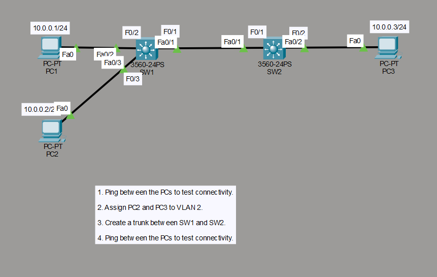
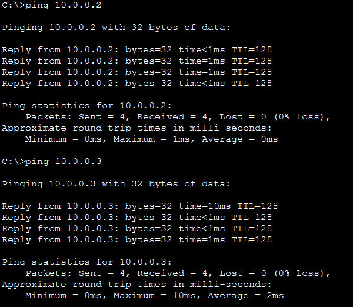
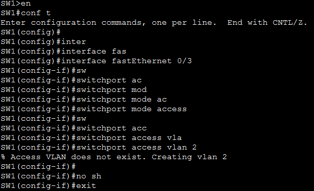
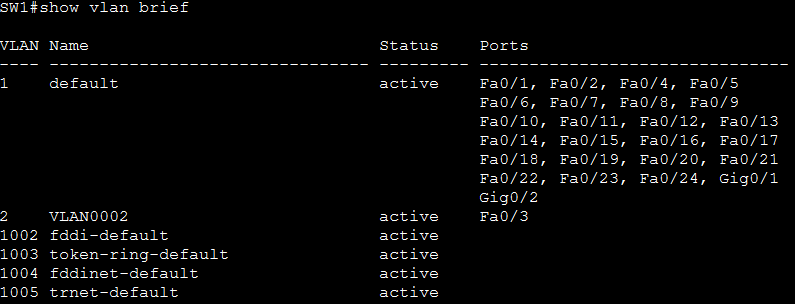
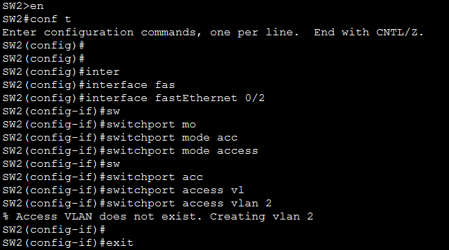
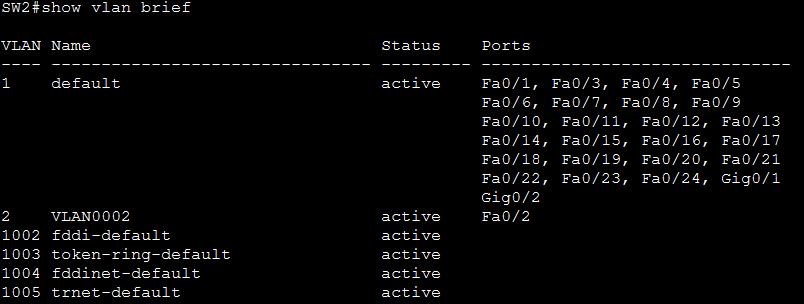
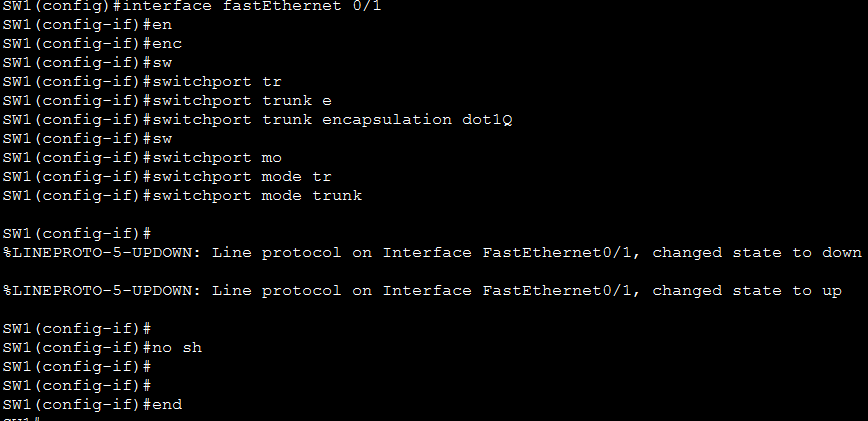
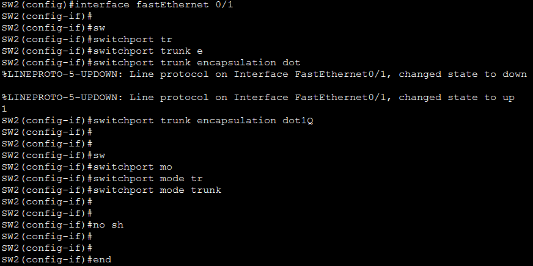
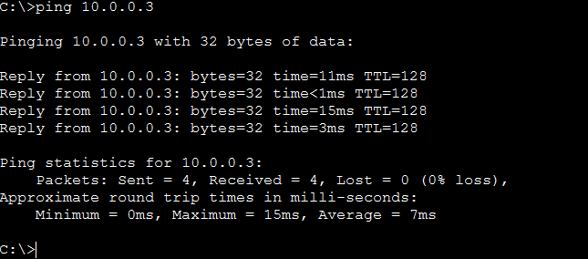
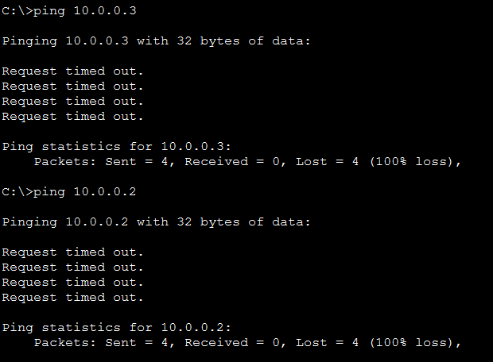

<div align="center">

# 🔀 Lab 006 — VLAN Configuration & Trunk Encapsulation


</div>

---

## 🎯 Objective

This lab demonstrates how VLANs segment a switched network into separate
broadcast domains, and how an **802.1Q trunk** is required to carry traffic
for multiple VLANs between two switches. It also shows the resulting
side effect of VLAN segmentation: hosts in **different VLANs cannot reach
each other** without Inter-VLAN routing (an SVI or a router-on-a-stick),
even though they still share the same IP subnet.

Key concepts covered:
- Default VLAN 1 behavior and flat-network connectivity
- Creating a VLAN and assigning access ports (`switchport access vlan`)
- Cisco 3560 encapsulation requirement (`switchport trunk encapsulation dot1q`)
- Configuring an 802.1Q trunk link between two switches
- Verifying VLAN membership with `show vlan brief`
- Diagnosing failed connectivity caused by VLAN isolation

---

## 🗺️ Topology



| Device | Type | Interface | IP Address | VLAN (Final) |
|--------|------|-----------|------------|---------------|
| PC1 | PC-PT | Fa0 | 10.0.0.1/24 | VLAN 1 (default) |
| PC2 | PC-PT | Fa0 | 10.0.0.2/24 | VLAN 2 |
| PC3 | PC-PT | Fa0 | 10.0.0.3/24 | VLAN 2 |
| SW1 | Cisco 3560-24PS | Fa0/1 → SW2, Fa0/2 → PC1, Fa0/3 → PC2 | — | Trunk / Access |
| SW2 | Cisco 3560-24PS | Fa0/1 → SW1, Fa0/2 → PC3 | — | Trunk / Access |

---

## 📋 Lab Tasks

1. Ping between the PCs to test connectivity.
2. Assign PC2 and PC3 to VLAN 2.
3. Create a trunk between SW1 and SW2.
4. Ping between the PCs to test connectivity.

---

## ⚙️ Step-by-Step Configuration

### 1️⃣ Baseline Connectivity Test (VLAN 1)

```bash
ping 10.0.0.2
ping 10.0.0.3
```



> **🔎 Observation:** All pings succeed because every switch port defaults
> to VLAN 1, placing all three PCs in the same broadcast domain and the
> same `10.0.0.0/24` subnet.

---

### 2️⃣ Assign PC2 and PC3 to VLAN 2

**SW1 — assign Fa0/3 (PC2's link) to VLAN 2:**

```bash
SW1> enable
SW1# configure terminal
SW1(config)# vlan 2
SW1(config-vlan)# name VLAN2
SW1(config-vlan)# exit
SW1(config)# interface FastEthernet0/3
SW1(config-if)# switchport mode access
SW1(config-if)# switchport access vlan 2
SW1(config-if)# exit
```



```bash
SW1# show vlan brief
```



> **🔎 Observation:** `show vlan brief` confirms VLAN 2 now exists
> (auto-created on first reference) and Fa0/3 has moved out of the
> VLAN 1 port list into VLAN 2.

**SW2 — assign Fa0/2 (PC3's link) to VLAN 2:**

```bash
SW2> enable
SW2# configure terminal
SW2(config)# vlan 2
SW2(config-vlan)# name VLAN2
SW2(config-vlan)# exit
SW2(config)# interface FastEthernet0/2
SW2(config-if)# switchport mode access
SW2(config-if)# switchport access vlan 2
SW2(config-if)# exit
```



```bash
SW2# show vlan brief
```



> **🔎 Observation:** Fa0/2 is now listed under VLAN 2 on SW2, mirroring
> the change made on SW1. Both PC2 and PC3 are now logically isolated
> from PC1, which remains on VLAN 1.

---

### 3️⃣ Create a Trunk Between SW1 and SW2

> ⚠️ **Note:** The Cisco Catalyst 3560 is a Layer 3-capable switch and
> requires the encapsulation type (`dot1q`) to be set explicitly before
> the port can be switched into trunk mode.

**SW1 configuration (Fa0/1):**

```bash
SW1(config)# interface FastEthernet0/1
SW1(config-if)# switchport trunk encapsulation dot1q
SW1(config-if)# switchport mode trunk
SW1(config-if)# end
```



**SW2 configuration (Fa0/1):**

```bash
SW2(config)# interface FastEthernet0/1
SW2(config-if)# switchport trunk encapsulation dot1q
SW2(config-if)# switchport mode trunk
SW2(config-if)# end
```



> **🔎 Observation:** Both link ends log a `LINEPROTO-5-UPDOWN` flap as
> the port renegotiates into trunk mode. Once `switchport mode trunk` is
> applied on both ends, the trunk forms and VLAN 2 traffic can now cross
> between SW1 and SW2.

---

### 4️⃣ Final Connectivity Test

```bash
ping 10.0.0.3
```



> **🔎 Observation:** ✅ **PC2 → PC3 succeeds.** Both hosts are in VLAN 2,
> and the 802.1Q trunk between SW1 and SW2 now carries that VLAN's
> traffic between the two switches.

```bash
ping 10.0.0.3
ping 10.0.0.2
```



> **🔎 Observation:** ❌ **PC1 → PC2 and PC1 → PC3 both fail (100% loss).**
> PC1 is still on VLAN 1 while PC2/PC3 are on VLAN 2 — different VLANs
> are different broadcast domains, so Layer 2 switching alone cannot
> deliver traffic between them, regardless of the fact that all three
> hosts share the same `10.0.0.0/24` IP subnet.

---

## 💡 Key Takeaway

VLANs segment a switch into isolated logical networks at Layer 2 — ports
in different VLANs cannot communicate even if they're addressed in the
same IP subnet. An **802.1Q trunk** lets multiple VLANs share a single
physical link between switches (tagging each frame with its VLAN ID), but
a trunk only extends VLANs across switches — it does **not** provide a
path between different VLANs. Crossing VLAN boundaries requires
Inter-VLAN routing, via a router-on-a-stick or a Layer 3 switch SVI,
neither of which was configured in this lab.

---

## 📊 Summary Table — Before vs. After VLAN Segmentation

| Ping Test | Before (All VLAN 1) | After (PC2/PC3 → VLAN 2 + Trunk) |
|-----------|:---:|:---:|
| PC1 → PC2 | ✅ Success | ❌ Fails (different VLANs) |
| PC1 → PC3 | ✅ Success | ❌ Fails (different VLANs) |
| PC2 → PC3 | ✅ Success | ✅ Success (same VLAN, via trunk) |

---

## 📁 Files in This Lab

```
006-vlan-configuration-trunk-encapsulation/
├── README.md
└── screenshots/
    ├── 01-topology-diagram.png
    ├── 02-initial-ping-vlan1.png
    ├── 03-sw1-vlan2-fa0-3-config.png
    ├── 04-sw1-show-vlan-brief.png
    ├── 05-sw2-vlan2-fa0-2-config.png
    ├── 06-sw2-show-vlan-brief.png
    ├── 07-sw1-trunk-config.png
    ├── 08-sw2-trunk-config.png
    ├── 09-ping-pc2-pc3-success.png
    └── 10-ping-pc1-pc2-pc3-fail.png
```

---

<div align="center">

**Part of the [Modules & Mindsets](#) CCNA 200-301 lab series**

</div>
