<h1 align="center">🔀 007 - Inter-VLAN Routing (Router-on-a-Stick)</h1>

<p align="center">
  
  
  
  
</p>

---

## 🎯 Objective

This lab demonstrates **Inter-VLAN Routing using the Router-on-a-Stick (ROAS)** method. Two access-layer switches each host two VLANs (VLAN 13 and VLAN 24) that must communicate through a single router interface, sub-divided into logical sub-interfaces. The lab teaches how to:

- Isolate hosts into separate VLANs on multiple switches
- Trunk VLAN traffic between switches and up to the router
- Configure `802.1Q` encapsulated sub-interfaces on a router to route between VLANs
- Verify Layer 2 (same-VLAN) vs. Layer 3 (inter-VLAN) connectivity behavior

---

## 🗺️ Topology


| Device | Role | Interface(s) Used | IP / VLAN Info |
|---|---|---|---|
| **R1** (Cisco 2901) | Router-on-a-Stick | G0/0, G0/0.13, G0/0.24 | .13 → `10.0.0.1/25`  •  .24 → `10.0.0.129/25` |
| **SW1** (2960-24TT) | Access + Trunk Switch | Fa0/1, Fa0/2, Gi0/1, Gi0/2 | Trunk to R1 (Gi0/1) & SW2 (Gi0/2) |
| **SW2** (2960-24TT) | Access + Trunk Switch | Fa0/1, Fa0/2, Gi0/1 | Trunk to SW1 (Gi0/1) |
| **PC1** | End device — VLAN 13 | Fa0 → SW1 Fa0/1 | `10.0.0.2/25` |
| **PC3** | End device — VLAN 13 | Fa0 → SW2 Fa0/1 | `10.0.0.3/25` |
| **PC2** | End device — VLAN 24 | Fa0 → SW1 Fa0/2 | `10.0.0.130/25` |
| **PC4** | End device — VLAN 24 | Fa0 → SW2 Fa0/2 | `10.0.0.131/25` |

---

## 📋 Lab Tasks

1. Ping between the PCs. Which pings succeed?
2. Assign PC1 and PC3 to VLAN 13, and PC2 and PC4 to VLAN 24.
3. Create a trunk link between SW1 and SW2.
4. Configure inter-VLAN routing by using sub-interfaces on R1's G0/0 interface. Use an address of `10.0.0.1/25` for VLAN 13 and `10.0.0.129/25` for VLAN 24.
5. Test connectivity by pinging between PCs.

---

## ⚙️ Step-by-Step Configuration

### 1️⃣ Baseline Connectivity Test (Before VLAN Configuration)

Before any VLAN or routing configuration, all four PCs sit in the same flat `/25` network, but pings across the "future VLAN" boundary already fail because the physical topology doesn't reflect the addressing plan yet.

**PC1 pings:**

```
C:\>ping 10.0.0.130   ! → Request timed out
C:\>ping 10.0.0.3     ! → Reply from 10.0.0.3 (success)
C:\>ping 10.0.0.131   ! → Request timed out
```

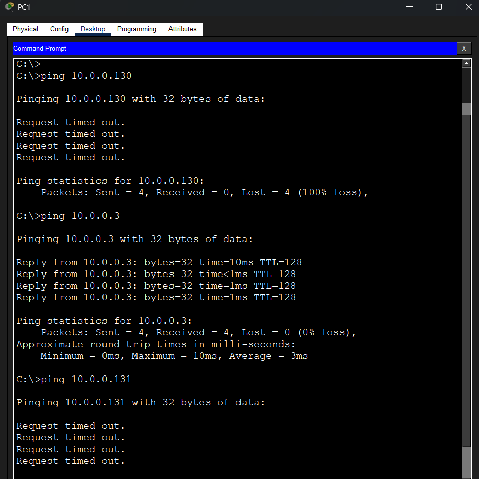

**PC2 pings:**

```
C:\>ping 10.0.0.131   ! → Reply from 10.0.0.131 (success)
C:\>ping 10.0.0.2     ! → Request timed out
```

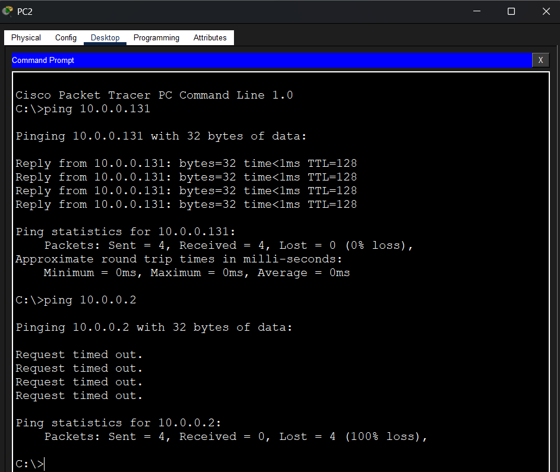

> 🔎 **Observation:** PC1 ↔ PC3 (both `10.0.0.0/25`) and PC2 ↔ PC4 (both `10.0.0.128/25`) succeed since they share a subnet. Cross-subnet pings (PC1/PC3 ↔ PC2/PC4) fail because the router interface is still down/unconfigured — routing hasn't been set up yet.

---

### 2️⃣ Assign PC1 & PC3 to VLAN 13, PC2 & PC4 to VLAN 24

**SW1 Configuration:**

```
SW1> enable
SW1# configure terminal
SW1(config)# vlan 13
SW1(config-vlan)# name VLAN13
SW1(config-vlan)# exit
SW1(config)# vlan 24
SW1(config-vlan)# name VLAN24
SW1(config-vlan)# exit
```

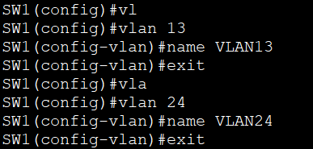

```
SW1(config)# interface FastEthernet0/1
SW1(config-if)# switchport mode access
SW1(config-if)# switchport access vlan 13
SW1(config-if)# exit

SW1(config)# interface FastEthernet0/2
SW1(config-if)# switchport mode access
SW1(config-if)# switchport access vlan 24
SW1(config-if)# exit
```

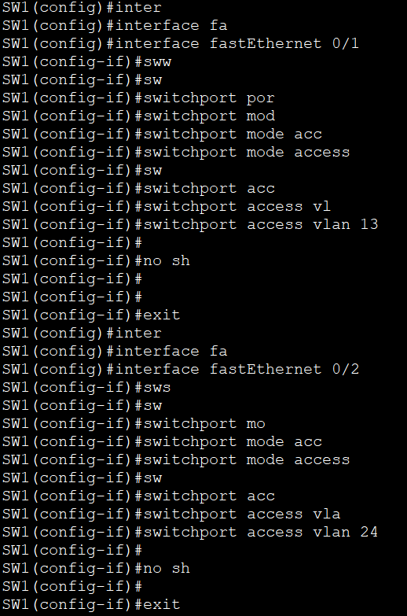

**SW2 Configuration:**

```
SW2> enable
SW2# configure terminal
SW2(config)# vlan 13
SW2(config-vlan)# name VLAN13
SW2(config-vlan)# exit
SW2(config)# vlan 24
SW2(config-vlan)# name VLAN24
SW2(config-vlan)# exit
```

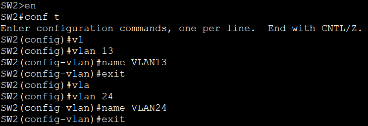

```
SW2(config)# interface FastEthernet0/1
SW2(config-if)# switchport mode access
SW2(config-if)# switchport access vlan 13
SW2(config-if)# exit

SW2(config)# interface FastEthernet0/2
SW2(config-if)# switchport mode access
SW2(config-if)# switchport access vlan 24
SW2(config-if)# exit
```

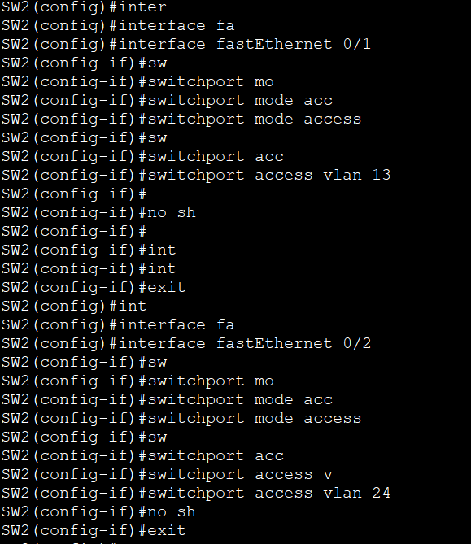

---

### 3️⃣ Create a Trunk Link Between SW1 and SW2

**SW1 (GigabitEthernet0/2):**

```
SW1(config)# interface GigabitEthernet0/2
SW1(config-if)# switchport mode trunk
SW1(config-if)# exit
```

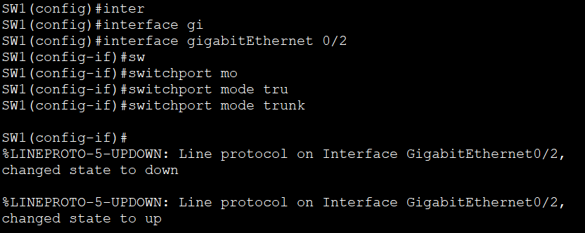

**SW2 (GigabitEthernet0/1):**

```
SW2(config)# interface GigabitEthernet0/1
SW2(config-if)# switchport mode trunk
SW2(config-if)# exit
```

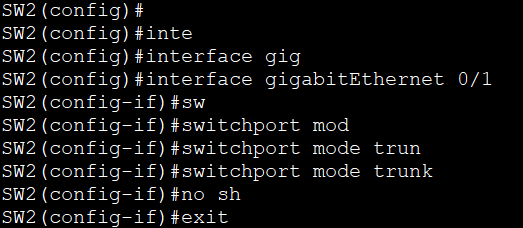

**SW1 → R1 link (also trunked for Router-on-a-Stick traffic):**

```
SW1(config)# interface GigabitEthernet0/1
SW1(config-if)# switchport mode trunk
SW1(config-if)# end
```

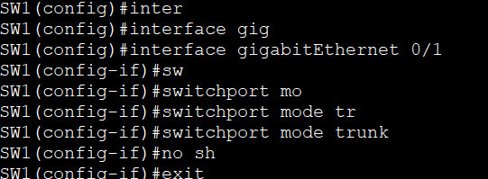

> 🔎 **Observation:** Both trunk ports flap (`down` → `up`) as `switchport mode trunk` is applied, confirming the 802.1Q trunk negotiation completed successfully on each link.

---

### 4️⃣ Configure Inter-VLAN Routing via Sub-Interfaces on R1

```
R1> enable
R1# configure terminal
R1(config)# interface GigabitEthernet0/0
R1(config-if)# no shutdown
R1(config-if)# exit
```

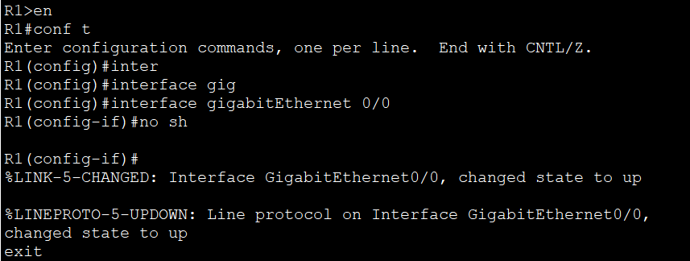

```
R1(config)# interface GigabitEthernet0/0.13
R1(config-subif)# encapsulation dot1Q 13
R1(config-subif)# ip address 10.0.0.1 255.255.255.128
R1(config-subif)# exit
```

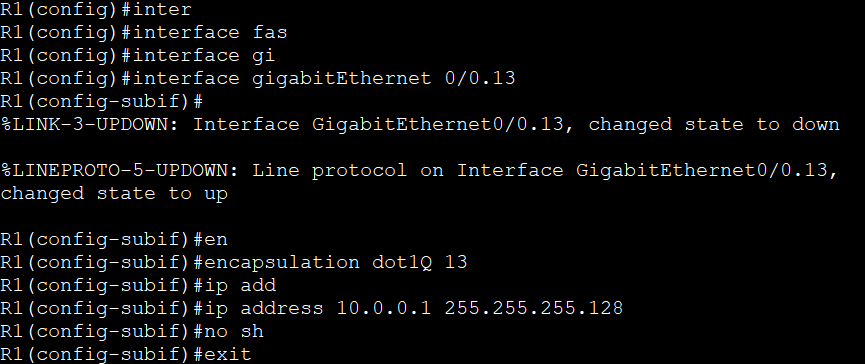

```
R1(config)# interface GigabitEthernet0/0.24
R1(config-subif)# encapsulation dot1Q 24
R1(config-subif)# ip address 10.0.0.129 255.255.255.128
R1(config-subif)# end
```

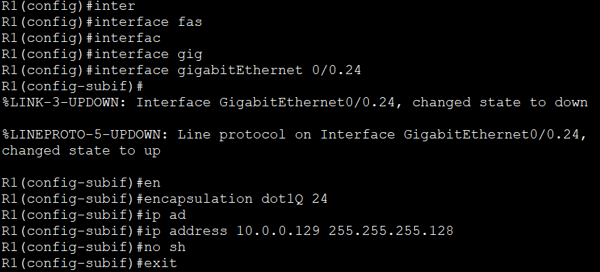

> 🔎 **Observation:** Each sub-interface requires its own `encapsulation dot1Q <vlan-id>` statement before an IP address can be assigned — this is what allows one physical interface (G0/0) to act as the default gateway for multiple VLANs simultaneously.

**Default gateways verified on PCs:**

| PC | VLAN | Default Gateway |
|---|---|---|
| PC1, PC3 | 13 | `10.0.0.1` |
| PC2, PC4 | 24 | `10.0.0.129` |

---

### 5️⃣ Test Connectivity Between PCs (Post-Configuration)

**PC1 → PC4 (10.0.0.131) and PC1 → PC3 (10.0.0.3):**

```
C:\>ping 10.0.0.131   ! → Reply from 10.0.0.131 (success, minor initial ARP timeout)
C:\>ping 10.0.0.3     ! → Reply from 10.0.0.3 (success)
```

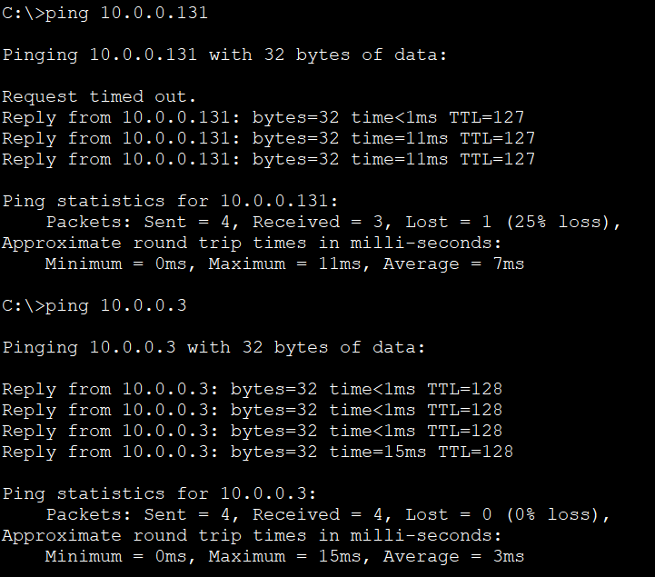

**PC4 → PC2 (10.0.0.2) and PC4 → PC1 (10.0.0.131):**

```
C:\>ping 10.0.0.2     ! → Reply from 10.0.0.2 (success)
C:\>ping 10.0.0.131   ! → Reply from 10.0.0.131 (success)
```

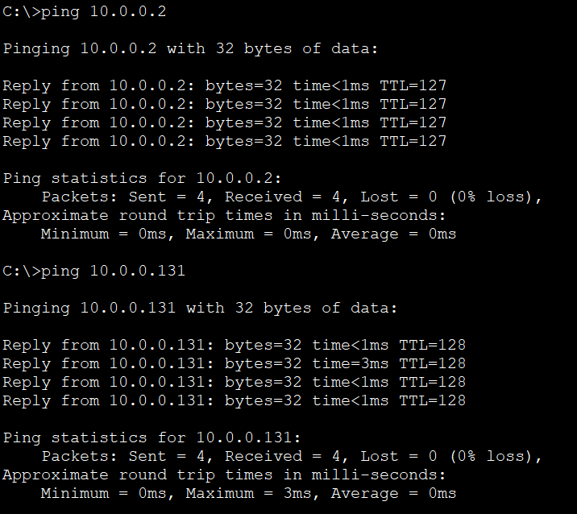

> 🔎 **Observation:** All pings now succeed. Same-VLAN traffic (PC1 ↔ PC3, PC2 ↔ PC4) switches directly across the trunk without touching the router. Inter-VLAN traffic (VLAN 13 ↔ VLAN 24) is routed through R1's sub-interfaces — confirmed by the first packet occasionally timing out (ARP resolution) before replies flow normally.

---

## 💡 Key Takeaway

A single physical router interface can serve as the default gateway for multiple VLANs by using **802.1Q sub-interfaces** (Router-on-a-Stick). Each sub-interface is bound to one VLAN via `encapsulation dot1Q <id>` and carries its own IP address, while the physical link to the switch must be configured as a **trunk** so tagged frames from every VLAN can reach the router. Switches only need trunk links between each other and toward the router — end-host ports stay in **access mode**.

---

## 📊 Summary Table — Before vs. After

| Ping Path | Before VLAN/Routing Config | After ROAS Config |
|---|---|---|
| PC1 ↔ PC3 (same VLAN 13) | ✅ Success (flat subnet) | ✅ Success (switched via trunk) |
| PC2 ↔ PC4 (same VLAN 24) | ✅ Success (flat subnet) | ✅ Success (switched via trunk) |
| PC1/PC3 ↔ PC2/PC4 (cross-VLAN) | ❌ Failed (router down/unconfigured) | ✅ Success (routed via R1 sub-interfaces) |

---

## 📁 Files in This Lab

```
007-Inter-VLAN-Routing-ROAS/
├── README.md
└── screenshots/
    ├── 01-topology-diagram.png
    ├── 02-pc1-preconfig-pings.png
    ├── 03-pc2-preconfig-pings.png
    ├── 04-sw1-vlan-creation.png
    ├── 05-sw1-access-ports.png
    ├── 06-sw2-vlan-creation.png
    ├── 07-sw2-access-ports.png
    ├── 08-sw1-trunk-gi0-2.png
    ├── 09-sw2-trunk-gi0-1.png
    ├── 10-sw1-trunk-gi0-1.png
    ├── 11-r1-g0-0-no-shutdown.png
    ├── 12-r1-subinterface-vlan13.png
    ├── 13-r1-subinterface-vlan24.png
    ├── 14-pc1-final-verification.png
    └── 15-pc4-final-verification.png
```
