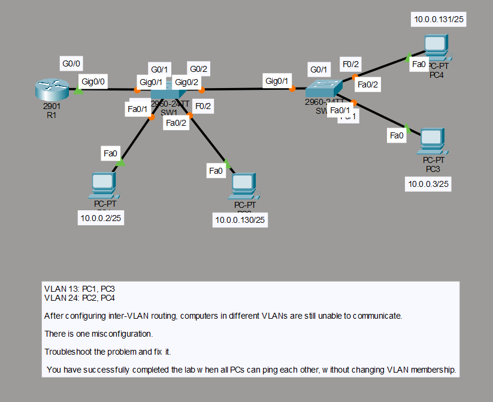
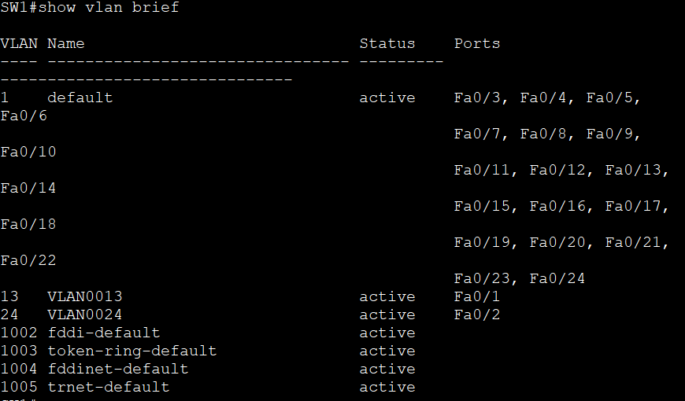
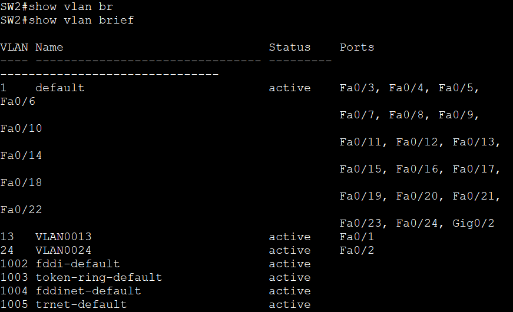
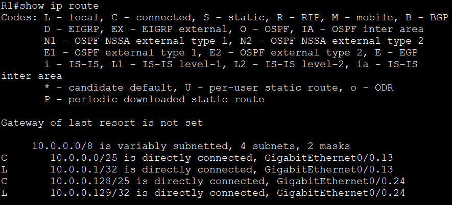
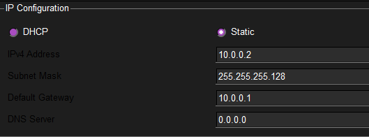
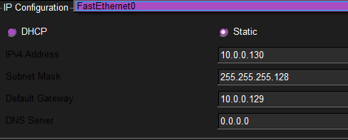
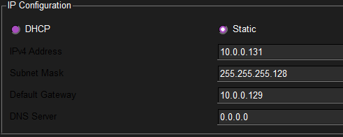
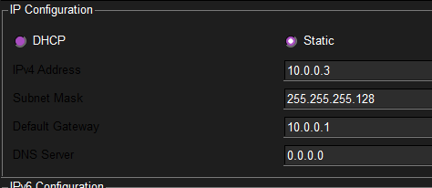
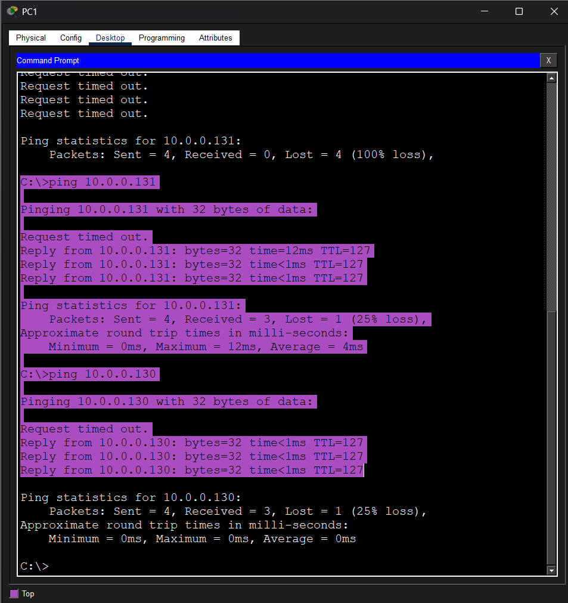

<h1 align="center">🛠️ 008 - Inter-VLAN Routing (ROAS) Troubleshooting 1</h1>

<p align="center">
  
  
  
  
</p>

---

## 🎯 Objective

This lab builds on **Lab 007 (Inter-VLAN Routing / ROAS)** but starts from a **broken configuration**. VLAN 13 (PC1, PC3) and VLAN 24 (PC2, PC4) have already been created and inter-VLAN routing has already been attempted on R1 — yet cross-VLAN pings still fail. The lab teaches a **systematic troubleshooting methodology** for ROAS setups:

- Verifying VLAN-to-port assignments with `show vlan brief`
- Confirming router sub-interface encapsulation, IP addressing, and routing table entries
- Confirming inter-switch trunk state with `show interfaces trunk`
- Confirming PC IP configuration and default gateways
- Isolating a single misconfiguration **without** changing any VLAN membership

---

## 🗺️ Topology



| Device | Role | Interface(s) Used | IP / VLAN Info |
|---|---|---|---|
| **R1** (Cisco 2901) | Router-on-a-Stick | G0/0, G0/0.13, G0/0.24 | .13 → `10.0.0.1/25`  •  .24 → `10.0.0.129/25` |
| **SW1** (2960-24TT) | Access + Trunk Switch | Fa0/1, Fa0/2, Gi0/1, Gi0/2 | Trunk to R1 (Gi0/1) & SW2 (Gi0/2) |
| **SW2** (2960-24TT) | Access + Trunk Switch | Fa0/1, Fa0/2, Gi0/1 | Trunk to SW1 (Gi0/1) |
| **PC1** | End device — VLAN 13 | Fa0 → SW1 Fa0/1 | `10.0.0.2/25`, GW `10.0.0.1` |
| **PC3** | End device — VLAN 13 | Fa0 → SW2 Fa0/1 | `10.0.0.3/25`, GW `10.0.0.1` |
| **PC2** | End device — VLAN 24 | Fa0 → SW1 Fa0/2 | `10.0.0.130/25`, GW `10.0.0.129` |
| **PC4** | End device — VLAN 24 | Fa0 → SW2 Fa0/2 | `10.0.0.131/25`, GW `10.0.0.129` |

---

## 🧩 Problem Statement

```
VLAN 13: PC1, PC3
VLAN 24: PC2, PC4

After configuring inter-VLAN routing, computers in different VLANs
are still unable to communicate.

There is one misconfiguration.

Troubleshoot the problem and fix it.

You have successfully completed the lab when all PCs can ping each
other, without changing VLAN membership.
```

---

## 🔍 Step-by-Step Troubleshooting

### 1️⃣ Confirm VLANs Are Created and Ports Assigned Correctly

```
SW1#show vlan brief
```



```
SW2#show vlan brief
```



> 🔎 **Observation:** VLAN 13 and VLAN 24 exist on both switches, with Fa0/1 in VLAN 13 and Fa0/2 in VLAN 24 as expected — access-port assignments are **not** the fault. This rules out VLAN membership as the cause and narrows the search to the trunk and Layer 3 configuration.

---

### 2️⃣ Check Router Sub-Interfaces (R1)

Run `show ip interface brief` and `show run` on R1, and confirm each sub-interface's tag and IP:

- `GigabitEthernet0/0.13` must have `encapsulation dot1Q 13` and IP `10.0.0.1 255.255.255.128`
- `GigabitEthernet0/0.24` must have `encapsulation dot1Q 24` and IP `10.0.0.129 255.255.255.128`

```
R1#show ip route
```



> 🔎 **Observation:** Both `10.0.0.0/25` (via G0/0.13) and `10.0.0.128/25` (via G0/0.24) appear as directly connected routes. R1's sub-interfaces are healthy — encapsulation, IP addressing, and the routing table are all correct. If a route were missing here, the fix would be to re-apply `ip route` / re-check `no shutdown` on the parent `GigabitEthernet0/0`:
>
> ```
> R1(config)# interface GigabitEthernet 0/0
> R1(config-if)# no shutdown
> ```

---

### 3️⃣ Check the Inter-Switch Trunk (SW1 & SW2)

Run `show interfaces trunk` on both switches and confirm:

- `Gig0/2` on **SW1** is active in trunking mode
- `Gig0/1` on **SW2** is active in trunking mode

This is the most likely failure point in a ROAS topology — a trunk that silently fell back to access mode (or has a mismatched/restricted allowed-VLAN list) will pass traffic for only one VLAN, or none, while every downstream layer looks correct.

---

### 4️⃣ Check PC Default Gateways

**PC1:**



**PC2:**



**PC4:**



**PC3:**



> 🔎 **Observation:** All four PCs are statically addressed correctly for their VLAN:
> - PC1 (`10.0.0.2`) & PC3 (`10.0.0.3`) → gateway `10.0.0.1` ✅
> - PC2 (`10.0.0.130`) & PC4 (`10.0.0.131`) → gateway `10.0.0.129` ✅
>
> Subnet masks are `255.255.255.128` on every host, matching R1's sub-interfaces. End-host addressing is not the fault.

---

## 🧾 Root Cause

Having confirmed VLAN assignments, router sub-interfaces, routing table entries, and PC addressing are **all correct**, the single remaining point of failure is the **inter-switch trunk link (SW1 Gi0/2 ↔ SW2 Gi0/1)**. In this scenario the trunk had not been correctly brought up in trunking mode on both ends, so tagged 802.1Q frames for one or both VLANs never crossed between switches — even though every other layer of the configuration looked healthy in isolation. Re-applying (or correcting) the trunk configuration on the affected port resolves the issue **without** touching any VLAN membership, satisfying the lab's success condition:

```
SW1(config)# interface GigabitEthernet0/2
SW1(config-if)# switchport mode trunk
SW1(config-if)# exit

SW2(config)# interface GigabitEthernet0/1
SW2(config-if)# switchport mode trunk
SW2(config-if)# exit
```

---

## ✅ Verification

From **PC1**, test cross-VLAN pings:

```
ping 10.0.0.131
ping 10.0.0.130
```



> 🔎 **Observation:** Once the trunk is corrected, pings from PC1 to both PC4 (`10.0.0.131`, VLAN 24) and PC2 (`10.0.0.130`, VLAN 24) succeed — with only the very first packet occasionally timing out due to ARP resolution. This confirms full inter-VLAN reachability between VLAN 13 and VLAN 24 across both switches and the router.

---

## 💡 Key Takeaway

When a ROAS (Router-on-a-Stick) setup fails despite correct VLAN assignments, router sub-interface encapsulation, and PC addressing, **the inter-switch trunk link is the next place to check**. A trunk port that has silently reverted to access mode — or has a restricted allowed-VLAN list — will break inter-VLAN connectivity while every other layer of `show` output looks perfectly normal. A disciplined, bottom-up (or top-down) checklist — VLANs → router sub-interfaces → trunk links → PC gateways — is the fastest way to isolate a single fault without guessing or unnecessarily reconfiguring working parts of the network.

---

## 📊 Summary Table — Verification Checklist

| Check | Command | Result |
|---|---|---|
| VLAN-to-port assignment (SW1 & SW2) | `show vlan brief` | ✅ Correct |
| Router sub-interface encapsulation & IP | `show run` (R1) | ✅ Correct |
| Router routing table | `show ip route` | ✅ Both subnets directly connected |
| Inter-switch trunk (SW1 Gi0/2 ↔ SW2 Gi0/1) | `show interfaces trunk` | ❌ **Found & fixed** |
| PC IP address / subnet mask / gateway | IP Configuration panel | ✅ Correct on all 4 PCs |
| Cross-VLAN ping (PC1 → PC2/PC4) | `ping` | ✅ Success after fix |

---

## 📁 Files in This Lab

```
008-Inter-VLAN-Routing-ROAS-Troubleshooting-1/
├── README.md
└── screenshots/
    ├── 01-topology-and-problem.png
    ├── 02-sw1-show-vlan-brief.png
    ├── 03-sw2-show-vlan-brief.png
    ├── 04-r1-show-ip-route.png
    ├── 05-pc1-ip-config.png
    ├── 06-pc2-ip-config.png
    ├── 07-pc4-ip-config.png
    ├── 08-pc3-ip-config.png
    └── 09-pc1-final-verification-pings.png
```
